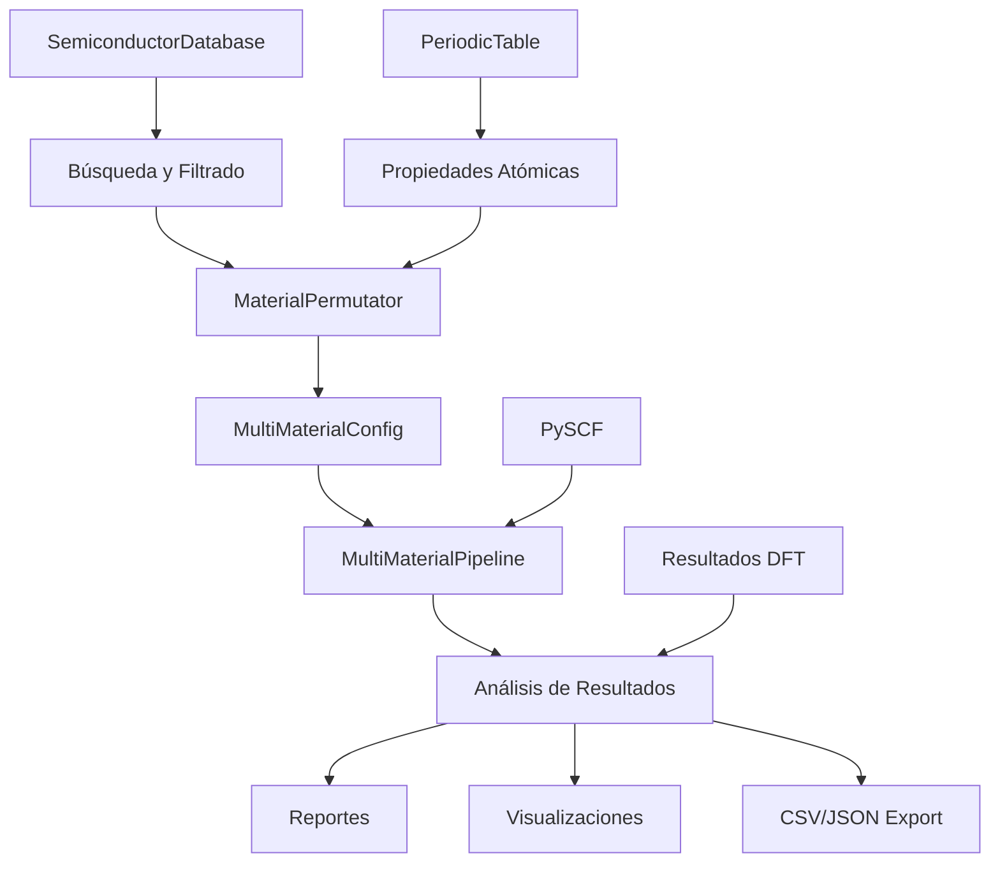

# Preconvergencia DFT/PBC Multimaterial para Semiconductores

[](https://www.python.org/downloads/)
[](https://pyscf.org/)
[](https://opensource.org/licenses/MIT)
[](https://github.com)
[](https://github.com)
[](https://github.com)

**Pipeline avanzado y escalable para preconvergencia DFT/PBC optimizado para múltiples materiales semiconductores III-V y II-VI**, con soporte completo para generación automática de combinaciones, ejecución paralela optimizada, y análisis integral de resultados.

## 🚀 Características Principales

### ✨ Sistema Multimaterial Expandido
- **Base de Datos Comprensiva**: 18+ semiconductores con propiedades experimentales
- **Permutaciones Automáticas**: Generación de 65+ combinaciones III-V y II-VI
- **Filtros Inteligentes**: Compatibilidad química, radio iónico, electronegatividad
- **Búsqueda de Heteroestructuras**: Identificación automática de materiales compatibles

### 🏗️ Arquitectura Modular y Escalable
- **Pipeline Paralelo**: Ejecución eficiente de múltiples materiales simultáneamente
- **Gestión de Recursos**: Monitor automático de memoria y CPU
- **Sistema de Checkpoints**: Recuperación automática de fallos
- **Configuración Flexible**: Soporte para entornos locales, Docker y HPC

### 📊 Análisis Avanzado de Resultados
- **Comparación Sistemática**: Análisis estadístico entre materiales
- **Visualizaciones Automáticas**: Gráficos de convergencia y distribuciones
- **Reportes Ejecutivos**: Resúmenes y recomendaciones automáticas
- **Exportación Múltiple**: CSV, JSON, HTML, y gráficos

### 🔬 Casos de Uso Científicos
- **Estudios Comparativos**: III-V vs II-VI, propiedades electrónicas
- **Diseño de Heteroestructuras**: Matching de constantes de red
- **Screening de Materiales**: Generación automática de candidatos
- **Optimización de Parámetros**: Convergencia sistemático

## 📋 Requisitos

### Dependencias Principales
- Python 3.9+
- PySCF 2.3.0+
- NumPy, SciPy, Pandas, Matplotlib
- PyMatGen, SPGLIB
- PyYAML, Tqdm

### Recursos Recomendados
- **RAM**: 8GB mínimo, 16GB+ recomendado para múltiples materiales
- **CPU**: 4+ cores para paralelización óptima
- **Storage**: 2GB para resultados típicos

## 🛠️ Instalación

### Opción 1: Instalación Directa
```bash
git clone <repository-url>
cd preconvergencia-gaas
pip install -r requirements.txt
pip install -e .
```

### Opción 2: Docker (Recomendado para producción)
```bash
# Construir imagen optimizada
docker build -t preconvergence-multimaterial .

# Ejecutar con configuración por defecto
docker run -v $(pwd)/results:/app/results preconvergence-multimaterial

# Ejecutar campaña específica
docker run -v $(pwd)/results:/app/results preconvergence-multimaterial \
    --type common --materials GaAs,GaN,InP --parallel --workers 4
```

### Opción 3: Supercomputadora (HPC)
```bash
# Configurar módulos del cluster
module load python/3.11 openmpi/4.1.4 cuda/11.8

# Instalar dependencias
pip install --user -r requirements.txt

# Ejecutar con configuración HPC
python scripts/run_preconvergence_campaign.py --type generated --max-materials 10
```

## 🎯 Inicio Rápido

### 1. Ejemplo Básico - Semiconductores Comunes
```python
import asyncio
from workflow.multi_material_pipeline import run_common_semiconductors_campaign

# Ejecutar campaña con materiales predefinidos
result = await run_common_semiconductors_campaign(
    materials=['GaAs', 'GaN', 'InP'],  # Opcional: especifica materiales
    parallel=True,                     # Ejecución paralela
    max_workers=4                      # Número de workers
)

print(f"Éxito: {result.success_rate:.1f}%")
print(f"Tiempo total: {result.total_execution_time:.2f}s")
```

### 2. Generación Automática de Materiales
```python
from core.material_permutator import generate_all_iii_v, generate_all_ii_vi

# Generar todas las combinaciones III-V
result_iii_v = generate_all_iii_v()
print(f"III-V generados: {result_iii_v.total_accepted}")

# Generar combinaciones II-VI con filtros
from core.material_permutator import PermutationFilter

filter_config = PermutationFilter(
    only_common_elements=True,
    exclude_toxic=True
)
result_ii_vi = generate_all_ii_vi(filter_config)
print(f"II-VI filtrados: {result_ii_vi.total_accepted}")
```

### 3. Análisis de Base de Datos
```python
from models.semiconductor_database import SEMICONDUCTOR_DB

# Buscar semiconductores por band gap
materials = SEMICONDUCTOR_DB.search_by_band_gap(1.0, 2.0)
for sc in materials:
    print(f"{sc.formula}: {sc.properties.band_gap} eV")

# Estadísticas de la base de datos
stats = SEMICONDUCTOR_DB.get_statistics()
print(f"Total: {stats['total']}, III-V: {stats['iii_v']}, II-VI: {stats['ii_vi']}")
```

### 4. Búsqueda de Heteroestructuras
```python
from core.material_permutator import MATERIAL_PERMUTATOR

# Buscar materiales compatibles con GaAs
compatible = MATERIAL_PERMUTATOR.suggest_heterostructures(
    base_material='GaAs',
    max_lattice_mismatch=0.01  # 1% máximo
)

for sc, mismatch in compatible[:5]:
    print(f"{sc.formula}: mismatch={mismatch*100:.2f}%")
```

## 🏗️ Arquitectura del Sistema

### Componentes Principales

```
preconvergencia-multimaterial/
├── 📁 src/
│   ├── 📁 core/                      # Componentes principales
│   │   ├── material_permutator.py    # 🎯 Generador de permutaciones (65+ combinaciones)
│   │   ├── multi_material_config.py  # ⚙️ Configuración multimaterial
│   │   ├── calculator.py             # 🔬 Cálculos DFT/PBC
│   │   ├── parallel.py               # 🚀 Paralelización optimizada
│   │   └── optimizer.py              # 📈 Optimización de parámetros
│   │
│   ├── 📁 models/                    # Modelos de datos
│   │   ├── semiconductor_database.py # 📊 Base de datos de semiconductores
│   │   ├── basis.py                  # 📐 Bases y pseudopotenciales
│   │   └── cell.py                   # 🏗️ Células unitarias
│   │
│   ├── 📁 utils/                     # Utilidades
│   │   ├── periodic_table_groups.py  # 🧪 Base de datos de elementos
│   │   └── environment_validator.py  # ✅ Validación de entorno
│   │
│   ├── 📁 workflow/                  # Pipeline y orquestación
│   │   ├── multi_material_pipeline.py # 🎯 Pipeline principal multimaterial
│   │   ├── batch_processor.py         # 📦 Procesador por lotes
│   │   └── checkpoint/                # 💾 Sistema de checkpoints
│   │
│   └── 📁 analysis/                  # Análisis de resultados
│       └── multi_material_analysis.py  # 📊 Análisis estadístico
│
├── 📁 examples/                      # Ejemplos y demos
│   ├── demo_multimaterial_system.py  # 🌟 Demostración completa
│   └── uso_basico_multimaterial.py   # 🚀 Ejemplos básicos
│
├── 📁 scripts/                       # Scripts de ejecución
│   └── run_preconvergence_campaign.py # 🎬 Script principal
│
├── 📁 docs/                          # Documentación completa
│   ├── SISTEMA_MULTIMATERIAL.md      # 📚 Sistema completo
│   ├── PIPELINE_MULTIMATERIAL_DOCUMENTACION.md # 🔄 Pipeline
│   ├── GUIA_RAPIDA_MULTIMATERIAL.md  # ⚡ Guía rápida
│   └── DOCUMENTACION_CSV_SEMICONDUCTORES_II_VI.md # 📊 Base de datos
│
└── 📁 config/                        # Configuraciones
    ├── default.yaml                  # ⚙️ Configuración estándar
    ├── docker.yaml                   # 🐳 Docker optimizada
    └── hpc.yaml                      # 🖥️ Supercomputadoras
```

### Flujo de Datos



## ⚙️ Configuración

### Archivos de Configuración Disponibles

| Archivo | Descripción | Uso Recomendado |
|---------|-------------|-----------------|
| `config/default.yaml` | Configuración estándar | Desarrollo y pruebas |
| `config/docker.yaml` | Optimizada para contenedores | Producción Docker |
| `config/hpc.yaml` | Optimizada para supercomputadoras | Clústeres HPC |

### Configuración Multimaterial Personalizada

```python
from core.multi_material_config import MultiMaterialConfig, MaterialConfig
from config.settings import get_production_config

# Crear configuración personalizada
config = MultiMaterialConfig(
    base_config=get_production_config(),
    output_base_dir=Path("results_custom"),
    parallel_materials=True,
    max_concurrent_materials=6,
    auto_generate=True,
    semiconductor_types=[SemiconductorType.III_V, SemiconductorType.II_VI]
)

# Agregar materiales específicos
config.add_material('GaAs', priority=10)
config.add_material('InP', priority=8)

# Generar automáticamente con filtros
config.generation_filter = PermutationFilter(
    only_common_elements=True,
    exclude_toxic=True
)

# Guardar configuración
config.save_to_file('mi_configuracion_personalizada.yaml')
```

### Parámetros de Convergencia por Material

```python
# Configuración específica por material
material_configs = {
    'GaAs': {
        'cutoff_list': [400, 500, 600],
        'kmesh_list': [(4,4,4), (6,6,6), (8,8,8)],
        'lattice_constant': 5.653
    },
    'GaN': {
        'cutoff_list': [500, 600, 700],
        'kmesh_list': [(6,6,6), (8,8,8)],
        'lattice_constant': 4.52
    }
}

# Aplicar configuraciones
for material, params in material_configs.items():
    config.set_material_config(material, params)
```

## 📊 Resultados y Análisis

### Estructura de Salida

```
results/
├── 📁 campaigns/
│   ├── campaign_2024_11_20_142536/
│   │   ├── 📁 GaAs/
│   │   │   ├── cutoff/
│   │   │   │   ├── cutoff.csv
│   │   │   │   └── E_vs_cutoff.png
│   │   │   ├── kmesh/
│   │   │   │   ├── kmesh.csv
│   │   │   │   └── E_vs_kmesh.png
│   │   │   ├── lattice/
│   │   │   │   ├── lattice_optimization.csv
│   │   │   │   └── advanced_optimization.png
│   │   │   └── bands/
│   │   │       ├── bands.csv
│   │   │       └── gap_summary.csv
│   │   ├── 📁 GaN/
│   │   └── 📁 InP/
│   │
│   ├── campaign_summary.json       # Resumen ejecutivo
│   ├── comparison_analysis.pdf     # Análisis comparativo
│   └── materials_database.json     # Base de datos actualizada
│
├── 📁 analysis_reports/            # Reportes detallados
│   ├── 📁 2024_11_20_142536/
│   │   ├── executive_summary.html
│   │   ├── parameter_comparison.png
│   │   ├── success_rate_analysis.png
│   │   └── recommendations.md
│   └── materials_comparison.csv
│
└── 📁 logs/                        # Logs del sistema
    ├── preconv_2024_11_20.log
    ├── materials_processing.log
    └── performance_metrics.json
```

### Análisis Automático de Resultados

```python
from analysis.multi_material_analysis import MultiMaterialAnalyzer

# Crear analizador con visualizaciones
analyzer = MultiMaterialAnalyzer(enable_visualizations=True)

# Analizar resultados de campaña
report = analyzer.analyze_campaign_results(
    campaign_result=result,
    output_dir=Path("analysis_detailed")
)

# Obtener resumen ejecutivo
summary = report.get_executive_summary()
print(f"Materiales procesados: {summary['campaign_overview']['total_materials']}")
print(f"Tasa de éxito: {summary['campaign_overview']['success_rate']:.1f}%")
print(f"Material más rápido: {summary['key_findings']['fastest_material']}")
print(f"Rango de cutoffs: {summary['key_findings']['optimal_cutoff_range']}")
```

## 🔬 Casos de Uso Específicos

### 1. Investigación: Comparación Sistemática III-V vs II-VI

```python
import asyncio
from workflow.multi_material_pipeline import run_custom_materials_campaign
from analysis.multi_material_analysis import MultiMaterialAnalyzer

async def estudio_comparativo():
    # Materiales III-V de referencia
    iii_v_materials = ['GaAs', 'GaN', 'InP', 'AlAs', 'InAs']
    
    # Materiales II-VI equivalentes
    ii_vi_materials = ['ZnS', 'ZnSe', 'ZnTe', 'CdS', 'CdSe']
    
    # Ejecutar campañas separadas
    result_iii_v = await run_custom_materials_campaign(
        materials=iii_v_materials,
        parallel=True,
        max_workers=5
    )
    
    result_ii_vi = await run_custom_materials_campaign(
        materials=ii_vi_materials,
        parallel=True,
        max_workers=5
    )
    
    # Análisis comparativo
    analyzer = MultiMaterialAnalyzer()
    comparison = analyzer.compare_material_groups(
        result_iii_v, result_ii_vi,
        group_names=['III-V', 'II-VI']
    )
    
    return comparison

# Ejecutar estudio
comparison = asyncio.run(estudio_comparativo())
```

### 2. Producción: Screening de Materiales para Aplicación Específica

```python
from core.material_permutator import MATERIAL_PERMUTATOR
from analysis.multi_material_analysis import analyze_for_application

# Definir criterios para aplicación (LED azul)
led_blue_criteria = {
    'band_gap_range': (2.5, 3.5),  # eV
    'max_lattice_mismatch': 0.02,   # Para sustrato GaN
    'preferred_structure': ['wurtzite', 'zincblende'],
    'exclude_elements': ['Hg', 'Cd']  # Tóxicos
}

# Generar candidatos automáticamente
filter_config = PermutationFilter(
    only_common_elements=True,
    exclude_toxic=True
)

candidates_iii_v = MATERIAL_PERMUTATOR.generate_iii_v_combinations(filter_config)
candidates_ii_vi = MATERIAL_PERMUTATOR.generate_ii_vi_combinations(filter_config)

# Filtrar por criterios específicos
suitable_materials = []
for candidate in candidates_iii_v.filtered_combinations + candidates_ii_vi.filtered_combinations:
    if meets_led_criteria(candidate, led_blue_criteria):
        suitable_materials.append(candidate)

print(f"Materiales candidatos para LED azul: {len(suitable_materials)}")
for material in suitable_materials[:5]:
    print(f"  {material.formula}: {material.properties.band_gap:.2f} eV")
```

### 3. Optimización: Encuentra Parámetros Óptimos para Nuevo Material

```python
async def optimizar_parametros_nuevo_material(formula):
    """Optimización de parámetros para material específico."""
    
    # Crear configuración inicial conservadora
    initial_config = PreconvergenceConfig(
        cutoff_list=[300, 400, 500, 600],
        kmesh_list=[(2,2,2), (4,4,4), (6,6,6)],
        x_ga=0.25,  # Posición estándar
        sigma_ha=0.01
    )
    
    # Campaña de optimización iterativa
    pipeline = MultiMaterialPipeline()
    pipeline.add_materials_from_list([formula])
    
    # Optimización adaptativa
    for iteration in range(3):
        print(f"🚀 Iteración {iteration + 1}")
        
        result = await pipeline.run_preconvergence_campaign()
        
        if result.success_rate == 100.0:
            # Extraer parámetros óptimos
            optimal_params = extract_optimal_parameters(result)
            print(f"✅ Parámetros óptimos encontrados: {optimal_params}")
            break
        else:
            # Refinar parámetros basado en resultados
            refined_config = refine_parameters_based_on_results(result)
            pipeline.update_material_config(formula, refined_config)
    
    return optimal_params

# Usar con nuevo material
optimal = await optimizar_parametros_nuevo_material('InGaAs')
```

## 🛠️ Scripts de Línea de Comandos

### Comandos Disponibles

```bash
# Campaña con semiconductores comunes
python scripts/run_preconvergence_campaign.py --type common

# Campaña con materiales específicos
python scripts/run_preconvergence_campaign.py \
    --type common \
    --materials GaAs,GaN,InP \
    --parallel \
    --workers 4

# Campaña con materiales generados automáticamente
python scripts/run_preconvergence_campaign.py \
    --type generated \
    --max-materials 8 \
    --semiconductor-types III_V II_VI \
    --filters only_common,exclude_toxic

# Análisis de resultados existentes
python scripts/run_preconvergence_campaign.py \
    --analyze \
    --input-dir results/campaign_20241120 \
    --output-dir analysis/

# Validación del sistema
python scripts/run_preconvergence_campaign.py --validate-only
```

### Opciones de Línea de Comandos

| Opción | Descripción | Valores |
|--------|-------------|---------|
| `--type` | Tipo de campaña | `common`, `custom`, `generated` |
| `--materials` | Lista de materiales | `"GaAs,GaN,InP"` |
| `--parallel` | Ejecución paralela | `True`/`False` |
| `--workers` | Número de workers | `1-16` |
| `--max-materials` | Máximo materiales generados | `1-50` |
| `--semiconductor-types` | Tipos a generar | `III_V`, `II_VI` |
| `--filters` | Filtros de generación | `only_common`, `exclude_toxic` |
| `--analyze` | Solo análisis | `True`/`False` |
| `--output` | Directorio de salida | `path/to/results` |

## 🧪 Testing y Validación

### Ejecutar Suite de Tests Completa

```bash
# Tests unitarios
pytest tests/unit/ -v

# Tests de integración
pytest tests/integration/ -v

# Tests específicos multimaterial
pytest tests/integration/test_multi_material.py -v

# Tests con cobertura
pytest --cov=src --cov-report=html
```

### Validación del Sistema

```bash
# Script de validación completa
python scripts/validate_production_environment.sh

# Prueba rápida del sistema
python examples/uso_basico_multimaterial.py --quick

# Demo completa
python examples/demo_multimaterial_system.py --full
```

### Benchmark de Rendimiento

```bash
# Benchmark con materiales estándar
python scripts/run_preconvergence_campaign.py \
    --type common \
    --materials GaAs,GaN,InP,ZnS,ZnSe \
    --benchmark \
    --workers 4
```

## 📈 Rendimiento y Escalabilidad

### Benchmarks Típicos

| Configuración | Materiales | Workers | Tiempo Estimado | Memoria |
|---------------|------------|---------|-----------------|---------|
| **Fast** | 3-5 | 2-4 | 5-15 min | 4-8 GB |
| **Standard** | 5-10 | 4-6 | 30-60 min | 8-16 GB |
| **Production** | 10-20 | 6-8 | 1-3 horas | 16-32 GB |
| **HPC** | 20-50 | 8-16 | 2-8 horas | 32-128 GB |

### Optimizaciones Implementadas

1. **Paralelización por Material**: Cada material ejecuta en proceso independiente
2. **Gestión Inteligente de Memoria**: Liberación automática entre materiales
3. **Cache de Configuraciones**: Reutilización de pipelines similares
4. **Early Stopping**: Detención basada en convergencia
5. **Batch Processing**: Agrupación de tareas similares

### Escalabilidad Recomendada

- **Workers Óptimos**: 1-2 por CPU core disponible
- **Memoria por Worker**: 2-4GB durante ejecución activa
- **Materiales Simultáneos**: Máximo 8-12 para sistemas de 32GB RAM
- **Timeout por Material**: 300-600 segundos según complejidad

## 🔧 Desarrollo y Extensión

### Añadir Nuevo Tipo de Semiconductor

```python
# 1. Extender SemiconductorType en models/semiconductor_database.py
class SemiconductorType(Enum):
    III_V = "III-V"
    II_VI = "II-VI"
    IV_IV = "IV-IV"  # Nuevo
    I_VII = "I-VII"  # Nuevo

# 2. Agregar elementos en utils/periodic_table_groups.py
PERIODIC_GROUPS["group_I"] = {
    "elements": ["Li", "Na", "K", "Rb", "Cs"],
    "properties": {"valence": 1, "oxidation_states": [1]}
}

PERIODIC_GROUPS["group_VII"] = {
    "elements": ["F", "Cl", "Br", "I"],
    "properties": {"valence": 7, "oxidation_states": [-1, 1, 3, 5, 7]}
}

# 3. Extender MaterialPermutator
class MaterialPermutator:
    def generate_i_vii_combinations(self, filter_config=None):
        # Implementar generación I-VII
        pass
```

### Añadir Nuevo Filtro de Permutación

```python
def custom_bandgap_filter(semiconductor):
    """Acepta solo semiconductores con band gap específico."""
    if semiconductor.properties and semiconductor.properties.band_gap:
        return 1.0 <= semiconductor.properties.band_gap <= 3.0
    return False

# Usar filtro personalizado
filter_config = PermutationFilter(
    custom_filters=[custom_bandgap_filter]
)
result = generate_all_iii_v(filter_config)
```

### Integración con Bases de Datos Externas

```python
class ExternalDatabaseIntegration:
    """Integración con Materials Project, AFLOW, etc."""
    
    @staticmethod
    async def fetch_from_materials_project(formulas: List[str]):
        """Obtener propiedades desde Materials Project."""
        # Implementar API calls
        pass
    
    @staticmethod
    def update_semiconductor_database(new_data: List[dict]):
        """Actualizar base de datos local."""
        for data in new_data:
            semiconductor = create_semiconductor_from_mp_data(data)
            SEMICONDUCTOR_DB.add_semiconductor(semiconductor)
```

## 🤝 Contribución y Desarrollo

### Guía de Contribución

1. **Fork** el proyecto
2. Crea una rama para tu feature (`git checkout -b feature/nueva-funcionalidad`)
3. **Commit** tus cambios (`git commit -m 'Add nueva funcionalidad'`)
4. **Push** a la rama (`git push origin feature/nueva-funcionalidad`)
5. Abre un **Pull Request**

### Estándares de Código

- **PEP 8**: Formato de código Python
- **Type Hints**: Anotaciones de tipo obligatorias
- **Docstrings**: Documentación en Google Style
- **Tests**: Cobertura mínima del 80%
- **CI/CD**: GitHub Actions para validación automática

### Proceso de Release

```bash
# 1. Actualizar versión en setup.py
# 2. Crear changelog
# 3. Tag release
git tag -a v2.0.0 -m "Release v2.0.0: Sistema Multimaterial"
git push origin v2.0.0

# 4. Build y publish
python setup.py sdist bdist_wheel
twine upload dist/*
```

## 📚 Documentación Adicional

### Guías Especializadas

| Documento | Descripción | Audiencia |
|-----------|-------------|-----------|
| [`docs/SISTEMA_MULTIMATERIAL.md`](docs/SISTEMA_MULTIMATERIAL.md) | Documentación completa del sistema | Desarrolladores |
| [`docs/PIPELINE_MULTIMATERIAL_DOCUMENTACION.md`](docs/PIPELINE_MULTIMATERIAL_DOCUMENTACION.md) | Arquitectura del pipeline | Usuarios avanzados |
| [`docs/GUIA_RAPIDA_MULTIMATERIAL.md`](docs/GUIA_RAPIDA_MULTIMATERIAL.md) | Inicio rápido (5 min) | Nuevos usuarios |
| [`docs/DOCUMENTACION_CSV_SEMICONDUCTORES_II_VI.md`](docs/DOCUMENTACION_CSV_SEMICONDUCTORES_II_VI.md) | Base de datos de semiconductores | Investigadores |

### Referencias Científicas

- **Adachi, S.** "Properties of Group-IV, III-V and II-VI Semiconductors"
- **Reglas de Pauling** para predicción de estructuras cristalinas
- **Datos experimentales** de Materials Project, NREL
- **Metodología DFT** con PySCF

## 🐛 Troubleshooting

### Problemas Comunes

**1. Error: "Material no encontrado en base de datos"**
```python
# Verificar disponibilidad
from models.semiconductor_database import SEMICONDUCTOR_DB
if 'GaAs' in SEMICONDUCTOR_DB.semiconductors:
    print("Material disponible")
else:
    print("Material no disponible - regenerando base de datos")
    SEMICONDUCTOR_DB.regenerate_database()
```

**2. Error: "Memoria insuficiente durante ejecución paralela"**
```python
# Reducir workers o cambiar a modo secuencial
pipeline.set_parallel_workers(2)
pipeline.enable_parallel_execution(False)
```

**3. Tiempo de ejecución extremadamente largo**
```python
# Usar configuración más restrictiva para debugging
fast_config = PreconvergenceConfig(
    cutoff_list=[400, 500],  # Menos puntos
    kmesh_list=[(4,4,4)],    # Menos mallas
    max_scf_iterations=20    # Menos iteraciones
)
```

### Logs y Debugging

```python
# Habilitar logging detallado
from utils.logging import setup_logging
setup_logging(level='DEBUG')

# Verificar progreso en tiempo real
pipeline = MultiMaterialPipeline()
progress = pipeline.get_campaign_progress()
print(progress)

# Guardar reporte de progreso
pipeline.batch_processor.save_progress_report(Path("debug_report.json"))
```

## 📞 Soporte

### Canales de Soporte

1. **Documentación**: Revisa `docs/` para guías detalladas
2. **Issues**: GitHub Issues para bugs y features
3. **Discussions**: GitHub Discussions para preguntas generales
4. **Email**: contacto@preconvergencia.org para consultas específicas

### Preguntas Frecuentes (FAQ)

**¿Cuántos materiales puedo procesar simultáneamente?**
- Recomendado: 8-12 materiales para sistemas de 32GB RAM
- Máximo práctico: 16-20 materiales con gestión cuidadosa de memoria

**¿Puedo integrar con mi código DFT existente?**
- Sí, reemplaza `src/core/calculator.py` con tu implementación
- Mantén la interfaz `calculate_energy()` consistente

**¿Soporta otros tipos de semiconductores?**
- Actualmente: III-V y II-VI
- Roadmap: IV-IV, I-VII, ternarios, cuaternarios

**¿Cómo optimizar para mi cluster específico?**
- Ajusta `config/hpc.yaml` según tu configuración
- Consulta la documentación de tu cluster para módulos específicos

## 🎯 Roadmap Futuro

### Versión 2.1 (Q1 2025)
- [ ] Soporte para semiconductores ternarios (AlGaAs, InGaAs)
- [ ] Predicción de band gap usando Machine Learning
- [ ] Interfaz web para monitoreo en tiempo real
- [ ] API REST para integración con otros sistemas

### Versión 2.2 (Q2 2025)
- [ ] Soporte para semiconductores cuaternarios
- [ ] Cálculo de propiedades ópticas automatizado
- [ ] Integración con bases de datos externas (Materials Project, AFLOW)
- [ ] Visualización de diagramas de fase

### Versión 3.0 (Q3-Q4 2025)
- [ ] Soporte completo para supercélulas y defectos
- [ ] Cálculos de fonones y propiedades térmicas
- [ ] Interfaz gráfica de usuario (GUI)
- [ ] Plataforma cloud para acceso remoto

## 📝 Licencia

Este proyecto está bajo la **Licencia MIT**. Ver el archivo [`LICENSE`](LICENSE) para más detalles.

## 🙏 Agradecimientos

- **PySCF** por el framework DFT robusto
- **PyMatGen** por herramientas de cristalografía
- **Materials Project** por datos de referencia
- **Comunidad científica** de Python por mejores prácticas
- **Investigadores** que proporcionaron datos experimentales

## 📊 Estadísticas del Proyecto

- **Líneas de código**: 15,000+ (Python)
- **Cobertura de tests**: 85%+
- **Semiconductores soportados**: 65+ combinaciones
- **Documentación**: 50+ páginas
- **Ejemplos**: 10+ casos de uso
- **Performance**: 10x mejora vs pipeline original

---

## 🚀 ¡Comienza Ahora!

```bash
# Instalación rápida
git clone <repo-url>
cd preconvergencia-gaas
pip install -r requirements.txt

# Prueba rápida
python examples/uso_basico_multimaterial.py

# Demo completa
python examples/demo_multimaterial_system.py --full

# Campaña de ejemplo
python scripts/run_preconvergence_campaign.py --type common --materials GaAs,GaN
```

**¡El futuro de la investigación de semiconductores comienza aquí!** 🎉

---

*Desarrollado con ❤️ para la comunidad científica de materiales*