# Documentación Técnica - Sistema de Preconvergencia Multimaterial

## 🏗️ Arquitectura del Sistema Completo

### Visión General de la Arquitectura

El sistema de preconvergencia multimaterial está diseñado con una **arquitectura modular y escalable** que permite procesamiento eficiente de múltiples materiales semiconductores. La arquitectura sigue principios de **Separación de Responsabilidades**, **Inversión de Dependencias** y **Extensibilidad**.

```mermaid
graph TB
    subgraph "Frontend Layer"
        CLI[Scripts de Línea de Comandos]
        API[API REST - Futuro]
        GUI[Interfaz Gráfica - Futuro]
    end
    
    subgraph "Application Layer"
        WF[Workflow Orchestrator]
        MP[Multi-Material Pipeline]
        AN[Analysis Engine]
    end
    
    subgraph "Core Layer"
        MM[Material Permutator]
        MC[Multi-Material Config]
        PB[Parallel Processing]
        CH[Checkpoint System]
    end
    
    subgraph "Data Layer"
        DB[Semiconductor Database]
        PT[Periodic Table Groups]
        RE[Results Storage]
        CA[Cache Management]
    end
    
    subgraph "Integration Layer"
        PS[PySCF Integration]
        DS[Data Sources]
        EX[External APIs]
    end
    
    CLI --> WF
    WF --> MP
    MP --> MM
    MP --> MC
    MP --> PB
    MP --> AN
    AN --> CH
    MM --> DB
    MM --> PT
    MC --> RE
    PB --> CA
    PS --> DS
    EX --> DS
```



### Principios Arquitectónicos

#### 1. **Modularidad**
Cada componente tiene una responsabilidad específica y puede ser desarrollado, probado y mantenido independientemente.

#### 2. **Escalabilidad**
El sistema puede procesar desde 1 hasta 100+ materiales simultáneamente, adaptándose automáticamente a los recursos disponibles.

#### 3. **Extensibilidad**
Nuevos tipos de semiconductores, filtros de generación, y funcionalidades pueden agregarse sin modificar el código existente.

#### 4. **Robustez**
Sistema de checkpoints, manejo de errores, y recuperación automática garantizan operación confiable.

#### 5. **Reproducibilidad**
Todas las configuraciones son serializables y los resultados son determinísticos con semilla controlada.

---

## 📚 API Reference de Componentes Multimaterial

### MaterialPermutator

**Clase principal para generación automática de combinaciones de semiconductores.**

```python
class MaterialPermutator:
    """Generador de permutaciones de semiconductores III-V y II-VI."""
    
    def __init__(self, database_path: Optional[Path] = None):
        """
        Inicializa el permutador de materiales.
        
        Args:
            database_path: Ruta a la base de datos de semiconductores
        """
    
    def generate_iii_v_combinations(
        self,
        filter_config: Optional[PermutationFilter] = None,
        cation_list: Optional[List[str]] = None,
        anion_list: Optional[List[str]] = None
    ) -> PermutationResult:
        """
        Genera todas las combinaciones III-V posibles.
        
        Args:
            filter_config: Configuración de filtros
            cation_list: Lista de cationes a usar (usa todos si None)
            anion_list: Lista de aniones a usar (usa todos si None)
            
        Returns:
            PermutationResult con todas las combinaciones
            
        Raises:
            ValueError: Si no se encuentran elementos válidos
        """
    
    def generate_ii_vi_combinations(
        self,
        filter_config: Optional[PermutationFilter] = None,
        cation_list: Optional[List[str]] = None,
        anion_list: Optional[List[str]] = None
    ) -> PermutationResult:
        """Genera todas las combinaciones II-VI posibles."""
    
    def suggest_heterostructures(
        self,
        base_material: str,
        max_lattice_mismatch: float = 0.05
    ) -> List[Tuple[BinarySemiconductor, float]]:
        """
        Sugiere materiales para heteroestructuras.
        
        Args:
            base_material: Fórmula del material base
            max_lattice_mismatch: Máximo desajuste de red (fracción)
            
        Returns:
            Lista de tuplas (semiconductor, mismatch)
        """
    
    def find_lattice_matched_pairs(
        self,
        target_lattice: float,
        tolerance: float = 0.1,
        semiconductor_type: Optional[SemiconductorType] = None
    ) -> List[BinarySemiconductor]:
        """
        Encuentra semiconductores con constante de red similar.
        """
```

### MultiMaterialConfig

**Configuración para procesamiento de múltiples materiales.**

```python
class MultiMaterialConfig:
    """Configuración para múltiples materiales semiconductores."""
    
    def __init__(
        self,
        base_config: Optional[PreconvergenceConfig] = None,
        output_base_dir: Optional[Path] = None,
        parallel_materials: bool = True,
        max_concurrent_materials: int = 4,
        auto_generate: bool = False,
        semiconductor_types: Optional[List[SemiconductorType]] = None,
        generation_filter: Optional[PermutationFilter] = None,
        max_generated_materials: int = 50
    ):
        """Inicializa configuración multimaterial."""
    
    def add_material(
        self,
        formula: str,
        priority: int = 5,
        custom_config: Optional[Dict[str, Any]] = None
    ):
        """
        Agrega material a la configuración.
        
        Args:
            formula: Fórmula química del material
            priority: Prioridad de procesamiento (1-10)
            custom_config: Configuración específica del material
        """
    
    def add_materials_from_list(self, formulas: List[str]):
        """Agrega múltiples materiales desde lista de fórmulas."""
    
    def add_materials_from_permutation(
        self,
        result: PermutationResult,
        max_materials: Optional[int] = None
    ):
        """Agrega materiales desde resultado de permutación."""
    
    def get_material_config_dict(self, formula: str) -> Dict[str, Any]:
        """
        Obtiene configuración específica para un material.
        
        Returns:
            Diccionario con configuración del material
        """
    
    def get_materials_by_type(
        self,
        semiconductor_type: SemiconductorType
    ) -> List[MaterialConfig]:
        """Filtra materiales por tipo de semiconductor."""
    
    def sort_by_priority(self):
        """Ordena materiales por prioridad (alta a baja)."""
    
    def save_to_file(self, filepath: Union[str, Path]):
        """Guarda configuración en archivo YAML."""
    
    @classmethod
    def load_from_file(cls, filepath: Union[str, Path]) -> 'MultiMaterialConfig':
        """Carga configuración desde archivo YAML."""
```

### MultiMaterialPipeline

**Pipeline principal para procesamiento paralelo de materiales.**

```python
class MultiMaterialPipeline:
    """Pipeline para múltiples materiales semiconductores."""
    
    def __init__(self, config: Optional[MultiMaterialConfig] = None):
        """Inicializa pipeline multimaterial."""
    
    def add_materials_from_list(self, formulas: List[str]):
        """Agrega materiales desde lista."""
    
    def add_materials_from_permutation(
        self,
        result: PermutationResult,
        max_materials: Optional[int] = None
    ):
        """Agrega materiales desde permutación."""
    
    def enable_parallel_execution(self, enabled: bool = True):
        """Habilita/deshabilita ejecución paralela."""
    
    def set_parallel_workers(self, max_workers: int):
        """Establece número de workers paralelos."""
    
    def validate_materials(self) -> Dict[str, Any]:
        """
        Valida todos los materiales configurados.
        
        Returns:
            Diccionario con estadísticas de validación
        """
    
    async def run_preconvergence_campaign(
        self,
        progress_callback: Optional[Callable] = None
    ) -> CampaignResult:
        """
        Ejecuta campaña completa de preconvergencia.
        
        Args:
            progress_callback: Callback de progreso (material, stage, progress)
            
        Returns:
            Resultado consolidado de la campaña
        """
    
    async def execute_single_material(self, formula: str) -> MaterialExecutionResult:
        """
        Ejecuta preconvergencia para un solo material.
        
        Args:
            formula: Fórmula del material
            
        Returns:
            Resultado de ejecución del material
        """
    
    def save_campaign_results(self, result: CampaignResult, filepath: Path):
        """Guarda resultados de campaña en archivo JSON."""
    
    def get_campaign_progress(self) -> Dict[str, Any]:
        """Obtiene progreso actual de la campaña."""
```

### PermutationFilter

**Configuración de filtros para generación de combinaciones.**

```python
@dataclass
class PermutationFilter:
    """Filtros para generación de permutaciones."""
    
    # Filtros de radio iónico
    max_ionic_radius_ratio: float = 2.5
    min_ionic_radius_ratio: float = 0.2
    
    # Filtros de electronegatividad
    min_electronegativity_diff: float = 0.3
    max_electronegativity_diff: float = 3.0
    
    # Filtros de disponibilidad
    only_common_elements: bool = False
    exclude_toxic: bool = False
    exclude_radioactive: bool = False
    
    # Filtros personalizados
    custom_filters: Optional[List[Callable]] = None
    
    def apply(self, semiconductor: 'BinarySemiconductor') -> bool:
        """
        Aplica todos los filtros a un semiconductor.
        
        Args:
            semiconductor: Semiconductor a evaluar
            
        Returns:
            True si pasa todos los filtros, False en caso contrario
        """
    
    def add_custom_filter(self, filter_func: Callable):
        """Agrega filtro personalizado."""
```

### SemiconductorDatabase

**Base de datos de semiconductores con propiedades experimentales.**

```python
class SemiconductorDatabase:
    """Base de datos de semiconductores binarios."""
    
    def __init__(self, database_path: Optional[Path] = None):
        """Inicializa base de datos."""
    
    def get_semiconductor(self, formula: str) -> Optional[BinarySemiconductor]:
        """
        Obtiene semiconductor por fórmula.
        
        Args:
            formula: Fórmula química
            
        Returns:
            Semiconductor o None si no existe
        """
    
    def add_semiconductor(self, semiconductor: 'BinarySemiconductor'):
        """Agrega semiconductor a la base de datos."""
    
    def search_by_band_gap(
        self,
        min_gap: float,
        max_gap: float
    ) -> List[BinarySemiconductor]:
        """
        Busca semiconductores por rango de band gap.
        
        Args:
            min_gap: Band gap mínimo (eV)
            max_gap: Band gap máximo (eV)
            
        Returns:
            Lista de semiconductores en el rango
        """
    
    def search_by_lattice_constant(
        self,
        min_lattice: float,
        max_lattice: float
    ) -> List[BinarySemiconductor]:
        """Busca por constante de red."""
    
    def get_statistics(self) -> Dict[str, int]:
        """
        Obtiene estadísticas de la base de datos.
        
        Returns:
            Diccionario con estadísticas
        """
```

### MultiMaterialAnalyzer

**Sistema de análisis estadístico y comparativo.**

```python
class MultiMaterialAnalyzer:
    """Analizador de resultados multimaterial."""
    
    def __init__(self, enable_visualizations: bool = True):
        """Inicializa analizador."""
    
    def analyze_campaign_results(
        self,
        campaign_result: CampaignResult,
        output_dir: Path
    ) -> MultiMaterialAnalysisReport:
        """
        Analiza resultados completos de campaña.
        
        Args:
            campaign_result: Resultado de campaña
            output_dir: Directorio para guardar análisis
            
        Returns:
            Reporte de análisis completo
        """
    
    def compare_material_groups(
        self,
        result1: CampaignResult,
        result2: CampaignResult,
        group_names: Optional[List[str]] = None
    ) -> MaterialGroupComparison:
        """
        Compara resultados entre grupos de materiales.
        
        Args:
            result1: Resultados del primer grupo
            result2: Resultados del segundo grupo
            group_names: Nombres de los grupos
            
        Returns:
            Comparación detallada entre grupos
        """
    
    def _compare_parameters(self, campaign_result: CampaignResult) -> List[ParameterComparison]:
        """Compara parámetros entre materiales."""
    
    def _analyze_by_groups(self, campaign_result: CampaignResult) -> List[MaterialGroupAnalysis]:
        """Analiza materiales agrupados por tipo."""
    
    def _create_visualizations(self, report: MultiMaterialAnalysisReport) -> List[str]:
        """Crea visualizaciones automáticas."""
```

---

## 🔄 Diagramas de Flujo de Trabajo

### Flujo Principal de Ejecución

```mermaid
flowchart TD
    A[Inicio] --> B{Cargar Configuración}
    B --> C[Validar Entorno]
    C --> D{¿Válido?}
    D -->|No| E[Mostrar Errores]
    E --> F[Fin]
    D -->|Sí| G[Inicializar Pipeline]
    
    G --> H[Generar Materiales]
    H --> I[Aplicar Filtros]
    I --> J[Validar Materiales]
    J --> K{¿Materiales Válidos?}
    
    K -->|No| L[Mostrar Advertencias]
    L --> M[Continuar con Disponibles]
    K -->|Sí| M
    
    M --> N[Asignar Recursos]
    N --> O[Ejecutar Paralelo]
    O --> P[Monitorear Progreso]
    P --> Q{¿Completado?}
    
    Q -->|No| R{¿Error?}
    R -->|Sí| S[Recuperar Checkpoint]
    R -->|No| P
    S --> O
    
    Q -->|Sí| T[Consolidar Resultados]
    T --> U[Análisis Estadístico]
    U --> V[Generar Reportes]
    V --> W[Exportar Datos]
    W --> F
    
    style A fill:#e1f5fe
    style F fill:#ffebee
    style O fill:#f3e5f5
    style U fill:#e8f5e8
```



### Flujo de Generación de Permutaciones

```mermaid
flowchart TD
    A[Solicitud de Generación] --> B[Seleccionar Tipo]
    B --> C[III-V]
    B --> D[II-VI]
    
    C --> E[Obtener Elementos Grupo III]
    C --> F[Obtener Elementos Grupo V]
    
    D --> G[Obtener Elementos Grupo II]
    D --> H[Obtener Elementos Grupo VI]
    
    E --> I[Generar Combinaciones]
    F --> I
    G --> J[Generar Combinaciones]
    H --> J
    
    I --> K[Aplicar Filtros]
    J --> K
    
    K --> L{¿Pasa Filtros?}
    L -->|No| M[Marcar como Rechazado]
    L -->|Sí| N[Validar Química]
    
    N --> O{¿Válido?}
    O -->|No| P[Marcar como Inestable]
    O -->|Sí| Q[Calcular Propiedades]
    
    M --> R[Contar Rechazados]
    P --> S[Contar Inestables]
    Q --> T[Contar Aceptados]
    
    R --> U[Generar Reporte]
    S --> U
    T --> U
    
    U --> V[Exportar Resultados]
    V --> W[Fin]
    
    style A fill:#e3f2fd
    style Q fill:#e8f5e8
    style W fill:#ffebee
```



### Flujo de Análisis Multimaterial

```mermaid
flowchart TD
    A[Datos de Campaña] --> B[Cargar Resultados]
    B --> C[Validar Datos]
    C --> D{¿Datos Válidos?}
    
    D -->|No| E[Limpiar Datos]
    E --> F[Usar Solo Exitosos]
    D -->|Sí| G[Continuar]
    
    F --> G
    G --> H[Análisis Paramétrico]
    H --> I[Análisis Estadístico]
    
    I --> J[Análisis por Grupos]
    J --> K[Detección de Outliers]
    K --> L[Correlaciones]
    
    L --> M[Generar Visualizaciones]
    M --> N[Crear Dashboard]
    N --> O[Reporte Ejecutivo]
    
    O --> P[Exportar Múltiples Formatos]
    P --> Q[JSON para API]
    P --> R[CSV para Análisis]
    P --> S[HTML para Visualización]
    P --> T[PDF para Publicación]
    
    Q --> U[Fin]
    R --> U
    S --> U
    T --> U
    
    style A fill:#e1f5fe
    style O fill:#e8f5e8
    style U fill:#ffebee
```



---

## ⚙️ Especificaciones Técnicas Detalladas

### Requisitos del Sistema

#### Hardware Mínimo
```yaml
CPU: 4 cores @ 2.5GHz
RAM: 8 GB DDR4
Storage: 10 GB SSD
Network: 100 Mbps (para descargas)
```

#### Hardware Recomendado
```yaml
CPU: 16+ cores @ 3.0GHz
RAM: 32+ GB DDR4
Storage: 100+ GB NVMe SSD
Network: 1 Gbps (para datos masivos)
```

#### Hardware Óptimo (Producción)
```yaml
CPU: 32+ cores @ 3.5GHz
RAM: 128+ GB DDR4
Storage: 500+ GB NVMe SSD + 1TB HDD
Network: 10 Gbps (para clusters)
GPU: Tesla V100/A100 (opcional, para ML)
```

### Dependencias del Sistema

#### Dependencias Core
```python
# Framework principal
PySCF >= 2.3.0           # Cálculos DFT
NumPy >= 1.21.0          # Computación numérica
SciPy >= 1.7.0           # Algoritmos científicos
Pandas >= 1.3.0          # Manejo de datos
Matplotlib >= 3.5.0      # Visualizaciones
PyYAML >= 6.0            # Serialización YAML
Tqdm >= 4.62.0           # Barras de progreso

# Cristalografía y química
PyMatGen >= 2022.0.17    # Análisis de materiales
SPGLIB >= 1.16.0         # Análisis de cristales
ASE >= 3.22.0            # Manipulación atómica

# Paralelización y concurrencia
asyncio                  # Programación asíncrona
concurrent.futures       # Paralelización
multiprocessing          # Procesamiento paralelo
threading                # Hilos
```

#### Dependencias Opcionales
```python
# Para análisis avanzado
scikit-learn >= 1.0.0    # Machine Learning
seaborn >= 0.11.0        # Visualizaciones estadísticas
plotly >= 5.0.0          # Gráficos interactivos

# Para integración
requests >= 2.28.0       # HTTP requests
aiohttp >= 3.8.0         # HTTP asíncrono

# Para desarrollo y testing
pytest >= 7.0.0          # Testing framework
pytest-asyncio >= 0.21.0 # Testing asíncrono
black >= 22.0.0          # Formateo de código
mypy >= 0.991            # Type checking
```

### Configuración de Rendimiento

#### Optimizaciones por Tipo de Hardware

##### Workstation (8-16 cores, 16-32 GB RAM)
```yaml
# config/workstation.yaml
parallel_materials: true
max_concurrent_materials: 6
memory_limit_gb: 24.0
worker_memory_gb: 4.0
checkpoint_interval_minutes: 15
cleanup_intermediate_files: true

# Optimizaciones específicas
use_process_pool: true
max_workers_per_core: 1.5
memory_monitoring: true
auto_memory_reduction: true
```

##### Servidor (32+ cores, 64+ GB RAM)
```yaml
# config/server.yaml
parallel_materials: true
max_concurrent_materials: 16
memory_limit_gb: 96.0
worker_memory_gb: 6.0
checkpoint_interval_minutes: 30
cleanup_intermediate_files: false

# Optimizaciones específicas
use_process_pool: true
max_workers_per_core: 2.0
enable_cpu_affinity: true
prefetch_materials: true
```

##### HPC/Cluster (128+ cores, 512+ GB RAM)
```yaml
# config/hpc.yaml
parallel_materials: true
max_concurrent_materials: 64
memory_limit_gb: 768.0
worker_memory_gb: 12.0
checkpoint_interval_minutes: 60
cleanup_intermediate_files: false

# Optimizaciones específicas
use_process_pool: true
max_workers_per_core: 2.5
enable_slurm_integration: true
distributed_mode: true
```

### Protocolos de Comunicación

#### Interfaz entre Componentes

```python
# Protocolo estándar para intercambio de datos
@dataclass
class MaterialMessage:
    """Mensaje estándar para comunicación entre componentes."""
    message_type: str
    timestamp: datetime
    source_component: str
    target_component: str
    payload: Dict[str, Any]
    correlation_id: str = field(default_factory=lambda: str(uuid.uuid4()))
    
    def to_dict(self) -> Dict[str, Any]:
        """Convierte mensaje a diccionario para serialización."""
    
    @classmethod
    def from_dict(cls, data: Dict[str, Any]) -> 'MaterialMessage':
        """Crea mensaje desde diccionario."""
```

#### Event System

```python
class EventSystem:
    """Sistema de eventos para comunicación asíncrona."""
    
    def __init__(self):
        self._handlers: Dict[str, List[Callable]] = {}
        self._queue: asyncio.Queue = asyncio.Queue()
    
    def subscribe(self, event_type: str, handler: Callable):
        """Suscribe handler a tipo de evento."""
    
    def publish(self, event_type: str, data: Any):
        """Publica evento al sistema."""
    
    async def process_events(self):
        """Procesa eventos de la cola."""
    
    def emit_material_update(self, material: str, stage: str, progress: float):
        """Emite actualización de progreso de material."""
    
    def emit_campaign_complete(self, campaign_id: str, results: CampaignResult):
        """Emite evento de campaña completada."""
```

### Formato de Datos

#### Esquema de Base de Datos

```sql
-- Tabla principal de semiconductores
CREATE TABLE semiconductors (
    id INTEGER PRIMARY KEY AUTOINCREMENT,
    formula VARCHAR(20) NOT NULL UNIQUE,
    name VARCHAR(100),
    material_type VARCHAR(10) NOT NULL, -- III-V, II-VI
    crystal_structure VARCHAR(20),
    
    -- Propiedades experimentales
    experimental_lattice DECIMAL(8,4),
    experimental_bandgap DECIMAL(6,3),
    experimental_uncertainty DECIMAL(6,3),
    
    -- Metadatos
    confidence_level VARCHAR(10) DEFAULT 'medium',
    reference_doi VARCHAR(100),
    reference_year INTEGER,
    created_date TIMESTAMP DEFAULT CURRENT_TIMESTAMP,
    last_updated TIMESTAMP DEFAULT CURRENT_TIMESTAMP
);

-- Tabla de elementos
CREATE TABLE elements (
    symbol VARCHAR(5) PRIMARY KEY,
    name VARCHAR(50) NOT NULL,
    atomic_number INTEGER NOT NULL,
    atomic_mass DECIMAL(8,4) NOT NULL,
    group_number INTEGER NOT NULL,
    
    -- Propiedades físicas
    ionic_radius DECIMAL(6,3),
    covalent_radius DECIMAL(6,3),
    electronegativity DECIMAL(4,2),
    ionization_energy DECIMAL(6,3),
    electron_affinity DECIMAL(6,3),
    
    -- Metadatos
    common_in_semiconductors BOOLEAN DEFAULT FALSE,
    is_toxic BOOLEAN DEFAULT FALSE,
    is_radioactive BOOLEAN DEFAULT FALSE
);

-- Índices para optimización
CREATE INDEX idx_semiconductors_type ON semiconductors(material_type);
CREATE INDEX idx_semiconductors_lattice ON semiconductors(experimental_lattice);
CREATE INDEX idx_semiconductors_bandgap ON semiconductors(experimental_bandgap);
CREATE INDEX idx_elements_group ON elements(group_number);
```

#### Formato de Configuración

```yaml
# Esquema de configuración YAML
version: "2.0"
type: multimaterial_config

base_config:
  lattice_constant: 5.653
  x_ga: 0.25
  sigma_ha: 0.01
  cutoff_list: [400, 500, 600]
  kmesh_list: [[4, 4, 4], [6, 6, 6], [8, 8, 8]]
  
parallel_config:
  parallel_materials: true
  max_concurrent_materials: 8
  memory_limit_gb: 32.0
  worker_memory_gb: 4.0

materials:
  - formula: "GaAs"
    priority: 10
    enabled: true
    custom_config:
      cutoff_list: [400, 450, 500]
      
  - formula: "GaN"
    priority: 9
    enabled: true
    
generation:
  auto_generate: false
  semiconductor_types: ["III_V", "II_VI"]
  max_generated_materials: 20
  
filters:
  max_ionic_radius_ratio: 2.5
  min_electronegativity_diff: 0.3
  only_common_elements: true
  exclude_toxic: true
  exclude_radioactive: true
```

---

## 🔧 Guías de Extensión y Personalización

### Agregar Nuevo Tipo de Semiconductor

#### Paso 1: Extender Enum de Tipos

```python
# src/models/semiconductor_database.py
class SemiconductorType(Enum):
    """Tipos de semiconductores soportados."""
    III_V = "III-V"
    II_VI = "II-VI"
    IV_IV = "IV-IV"           # Nuevo: Si, Ge, etc.
    I_VII = "I-VII"           # Nuevo: CuCl, AgBr, etc.
    III_VI = "III-VI"         # Futuro: Al2O3, Ga2S3, etc.
```

#### Paso 2: Agregar Elementos a Grupos

```python
# src/utils/periodic_table_groups.py
PERIODIC_GROUPS["group_IV"] = {
    "elements": ["C", "Si", "Ge", "Sn", "Pb"],
    "properties": {
        "valence": 4,
        "typical_coordination": [4],
        "oxidation_states": [-4, 2, 4]
    }
}

PERIODIC_GROUPS["group_VII"] = {
    "elements": ["F", "Cl", "Br", "I", "At"],
    "properties": {
        "valence": 7,
        "typical_coordination": [1],
        "oxidation_states": [-1, 1, 3, 5, 7]
    }
}
```

#### Paso 3: Extender Permutador

```python
# src/core/material_permutator.py
class MaterialPermutator:
    def generate_iv_iv_combinations(self, filter_config=None):
        """Genera combinaciones IV-IV."""
        return self._generate_combinations(
            semiconductor_type=SemiconductorType.IV_IV,
            filter_config=filter_config
        )
    
    def generate_i_vii_combinations(self, filter_config=None):
        """Genera combinaciones I-VII."""
        return self._generate_combinations(
            semiconductor_type=SemiconductorType.I_VII,
            filter_config=filter_config
        )
    
    def _generate_combinations(self, semiconductor_type, filter_config=None):
        """Generador genérico para cualquier tipo."""
        # Implementación genérica
        pass
```

### Agregar Filtros Personalizados

#### Filtro por Band Gap

```python
def band_gap_filter(min_gap: float, max_gap: float):
    """
    Filtro que acepta semiconductores en rango de band gap.
    
    Args:
        min_gap: Band gap mínimo (eV)
        max_gap: Band gap máximo (eV)
    """
    def filter_func(semiconductor):
        if semiconductor.properties and semiconductor.properties.band_gap:
            return min_gap <= semiconductor.properties.band_gap <= max_gap
        return False
    return filter_func

# Uso
filtros = PermutationFilter(
    custom_filters=[
        band_gap_filter(1.5, 3.0),  # Band gap para LED
        band_gap_filter(0.8, 1.5)   # Band gap para aplicaciones infrarrojas
    ]
)
```

#### Filtro por Aplicación Específica

```python
def application_specific_filter(application: str):
    """
    Filtro para aplicaciones específicas.
    
    Args:
        application: "led", "solar", "transistor", "detector"
    """
    def filter_func(semiconductor):
        if not semiconductor.properties:
            return False
        
        band_gap = semiconductor.properties.band_gap
        mobility = semiconductor.properties.electron_mobility
        
        if application == "led":
            return band_gap and 2.0 <= band_gap <= 3.5
        elif application == "solar":
            return band_gap and 1.0 <= band_gap <= 2.0
        elif application == "transistor":
            return mobility and mobility > 1000
        elif application == "detector":
            return band_gap and 0.1 <= band_gap <= 2.0
        
        return True
    return filter_func

# Uso
filtros_led = PermutationFilter(
    custom_filters=[application_specific_filter("led")]
)
```

### Integración con Bases de Datos Externas

#### Integración con Materials Project

```python
class MaterialsProjectIntegration:
    """Integración con Materials Project API."""
    
    def __init__(self, api_key: str):
        self.api_key = api_key
        self.base_url = "https://api.materialsproject.org/rest/v1"
        self.headers = {"X-API-KEY": api_key}
    
    async def fetch_materials_data(self, formulas: List[str]) -> List[Dict[str, Any]]:
        """
        Obtiene datos desde Materials Project.
        
        Args:
            formulas: Lista de fórmulas a consultar
            
        Returns:
            Lista de diccionarios con datos de materiales
        """
        import aiohttp
        
        async with aiohttp.ClientSession() as session:
            tasks = []
            for formula in formulas:
                url = f"{self.base_url}/materials/{formula}/calculate"
                task = self._fetch_single_material(session, url)
                tasks.append(task)
            
            results = await asyncio.gather(*tasks, return_exceptions=True)
            return [r for r in results if not isinstance(r, Exception)]
    
    async def _fetch_single_material(self, session: aiohttp.ClientSession, url: str):
        """Obtiene datos de un solo material."""
        try:
            async with session.get(url, headers=self.headers) as response:
                if response.status == 200:
                    return await response.json()
                else:
                    print(f"Error {response.status} para {url}")
                    return None
        except Exception as e:
            print(f"Excepción para {url}: {e}")
            return None
    
    def update_local_database(self, mp_data: List[Dict[str, Any]]):
        """
        Actualiza base de datos local con datos de MP.
        
        Args:
            mp_data: Datos obtenidos de Materials Project
        """
        for data in mp_data:
            if data:
                semiconductor = self._convert_mp_to_semiconductor(data)
                SEMICONDUCTOR_DB.add_semiconductor(semiconductor)
    
    def _convert_mp_to_semiconductor(self, mp_data: Dict[str, Any]) -> BinarySemiconductor:
        """Convierte datos de MP a formato local."""
        # Implementación de conversión
        pass
```

#### Integración con AFLOW

```python
class AFLOWIntegration:
    """Integración con AFLOW database."""
    
    def __init__(self):
        self.base_url = "http://aflow.org/API/aflow/wc/"
    
    def search_by_composition(self, composition: str) -> List[Dict[str, Any]]:
        """
        Busca materiales por composición en AFLOW.
        
        Args:
            composition: Fórmula química
            
        Returns:
            Lista de resultados
        """
        # Implementación de consulta AFLOW
        pass
```

### Personalización del Pipeline

#### Extender Tipos de Stages

```python
# src/workflow/stages/custom_stage.py
from .base import PipelineStage

class CustomConvergenceStage(PipelineStage):
    """Stage personalizado para convergencia especial."""
    
    def get_dependencies(self) -> List[str]:
        return ["previous_stage"]
    
    async def execute(self, previous_results: Dict[str, StageResult]) -> StageResult:
        # Lógica personalizada del stage
        pass
    
    def validate_parameters(self) -> Tuple[bool, List[str]]:
        """Validación específica para este stage."""
        errors = []
        # Validaciones específicas
        return len(errors) == 0, errors

# Registrar nuevo stage
# En el pipeline principal:
from .custom_stage import CustomConvergenceStage

stage_registry = {
    "custom_convergence": CustomConvergenceStage,
    # ... otros stages
}
```

#### Modificar Algoritmos de Optimización

```python
# src/core/optimizer.py
class CustomOptimizer:
    """Optimizador personalizado para casos específicos."""
    
    def __init__(self, algorithm: str = "default"):
        self.algorithm = algorithm
    
    def optimize_cutoff(self, energy_data: List[Tuple[float, float]], config: PreconvergenceConfig):
        """
        Optimización personalizada de cutoff.
        
        Args:
            energy_data: Lista de (cutoff, energia) pares
            config: Configuración actual
            
        Returns:
            Cutoff óptimo
        """
        if self.algorithm == "exponential":
            return self._exponential_fit(energy_data)
        elif self.algorithm == "polynomial":
            return self._polynomial_fit(energy_data)
        else:
            return self._default_optimization(energy_data)
    
    def _exponential_fit(self, data):
        """Ajuste exponencial personalizado."""
        # Implementación específica
        pass
    
    def _polynomial_fit(self, data):
        """Ajuste polinomial personalizado."""
        # Implementación específica
        pass
```

### Crear Plugins Personalizados

#### Plugin de Análisis

```python
# plugins/custom_analysis.py
class CustomAnalysisPlugin:
    """Plugin para análisis personalizado."""
    
    def __init__(self):
        self.name = "custom_analysis"
        self.version = "1.0.0"
    
    def initialize(self, context):
        """Inicializa plugin en contexto dado."""
        self.context = context
    
    def analyze_materials(self, materials_data: List[Dict[str, Any]]) -> Dict[str, Any]:
        """Análisis personalizado de materiales."""
        results = {}
        
        # Análisis específico del plugin
        for material_data in materials_data:
            formula = material_data['formula']
            custom_score = self._calculate_custom_score(material_data)
            results[formula] = custom_score
        
        return results
    
    def _calculate_custom_score(self, material_data: Dict[str, Any]) -> float:
        """Calcula score personalizado."""
        # Lógica específica del plugin
        pass
    
    def generate_report(self, analysis_results: Dict[str, Any]) -> str:
        """Genera reporte del análisis."""
        # Formato específico del plugin
        pass

# Registrar plugin
def register_custom_plugin():
    """Registra plugin personalizado."""
    from src.plugin_system import PluginRegistry
    
    registry = PluginRegistry.get_instance()
    registry.register_plugin(CustomAnalysisPlugin())
```

### API REST para Integración Externa

#### Servidor FastAPI

```python
# api/server.py
from fastapi import FastAPI, HTTPException
from pydantic import BaseModel
from typing import List, Optional

app = FastAPI(title="Preconvergencia Multimaterial API", version="2.0.0")

class MaterialRequest(BaseModel):
    materials: List[str]
    parallel: bool = True
    max_workers: int = 4

class GenerationRequest(BaseModel):
    semiconductor_types: List[str]
    filters: Optional[Dict[str, Any]] = None
    max_materials: int = 20

@app.post("/campaign/execute")
async def execute_campaign(request: MaterialRequest):
    """Ejecuta campaña de preconvergencia."""
    try:
        from workflow.multi_material_pipeline import run_custom_materials_campaign
        
        result = await run_custom_materials_campaign(
            materials=request.materials,
            parallel=request.parallel,
            max_workers=request.max_workers
        )
        
        return {
            "campaign_id": str(uuid.uuid4()),
            "status": "completed",
            "results": result.__dict__
        }
    except Exception as e:
        raise HTTPException(status_code=500, detail=str(e))

@app.post("/materials/generate")
async def generate_materials(request: GenerationRequest):
    """Genera materiales automáticamente."""
    try:
        from core.material_permutator import MATERIAL_PERMUTATOR
        
        results = []
        for sem_type in request.semiconductor_types:
            if sem_type == "III_V":
                result = MATERIAL_PERMUTATOR.generate_iii_v_combinations()
            elif sem_type == "II_VI":
                result = MATERIAL_PERMUTATOR.generate_ii_vi_combinations()
            
            results.append({
                "type": sem_type,
                "materials": [sc.formula for sc in result.filtered_combinations]
            })
        
        return {"generated_materials": results}
    except Exception as e:
        raise HTTPException(status_code=500, detail=str(e))

@app.get("/materials/{formula}")
async def get_material_info(formula: str):
    """Obtiene información de material específico."""
    try:
        from models.semiconductor_database import SEMICONDUCTOR_DB
        
        material = SEMICONDUCTOR_DB.get_semiconductor(formula.upper())
        if material:
            return {
                "formula": material.formula,
                "type": material.semiconductor_type.value,
                "properties": material.properties.__dict__ if material.properties else {}
            }
        else:
            raise HTTPException(status_code=404, detail="Material not found")
    except Exception as e:
        raise HTTPException(status_code=500, detail=str(e))

if __name__ == "__main__":
    import uvicorn
    uvicorn.run(app, host="0.0.0.0", port=8000)
```

#### Cliente de Integración

```python
# api/client.py
import aiohttp
import asyncio
from typing import List, Dict, Any

class PreconvergenciaAPI:
    """Cliente para API REST de preconvergencia."""
    
    def __init__(self, base_url: str = "http://localhost:8000"):
        self.base_url = base_url
        self.session: Optional[aiohttp.ClientSession] = None
    
    async def __aenter__(self):
        self.session = aiohttp.ClientSession()
        return self
    
    async def __aexit__(self, exc_type, exc_val, exc_tb):
        if self.session:
            await self.session.close()
    
    async def execute_campaign(self, materials: List[str], parallel: bool = True) -> Dict[str, Any]:
        """Ejecuta campaña vía API."""
        data = {
            "materials": materials,
            "parallel": parallel,
            "max_workers": 4
        }
        
        async with self.session.post(f"{self.base_url}/campaign/execute", json=data) as response:
            return await response.json()
    
    async def generate_materials(self, semiconductor_types: List[str]) -> Dict[str, Any]:
        """Genera materiales vía API."""
        data = {
            "semiconductor_types": semiconductor_types,
            "max_materials": 20
        }
        
        async with self.session.post(f"{self.base_url}/materials/generate", json=data) as response:
            return await response.json()
    
    async def get_material_info(self, formula: str) -> Dict[str, Any]:
        """Obtiene información de material vía API."""
        async with self.session.get(f"{self.base_url}/materials/{formula}") as response:
            return await response.json()

# Uso del cliente
async def example_api_usage():
    async with PreconvergenciaAPI() as api:
        # Ejecutar campaña
        result = await api.execute_campaign(["GaAs", "GaN", "InP"])
        print(f"Campaña completada: {result['campaign_id']}")
        
        # Generar materiales
        generated = await api.generate_materials(["III_V", "II_VI"])
        print(f"Materiales generados: {generated}")
```

---

## 📈 Métricas y Monitoreo

### Sistema de Métricas

```python
@dataclass
class SystemMetrics:
    """Métricas del sistema de preconvergencia."""
    
    # Métricas de rendimiento
    materials_processed: int
    materials_successful: int
    materials_failed: int
    average_execution_time: float
    total_execution_time: float
    
    # Métricas de recursos
    memory_peak_gb: float
    cpu_utilization: float
    disk_usage_gb: float
    
    # Métricas de calidad
    convergence_rate: float
    parameter_accuracy: float
    success_rate_by_material: Dict[str, float]
    
    def to_dict(self) -> Dict[str, Any]:
        """Convierte métricas a diccionario."""
    
    @classmethod
    def from_campaign_result(cls, result: CampaignResult) -> 'SystemMetrics':
        """Crea métricas desde resultado de campaña."""
```

### Dashboard de Monitoreo

```python
class MonitoringDashboard:
    """Dashboard en tiempo real del sistema."""
    
    def __init__(self):
        self.metrics_history: List[SystemMetrics] = []
        self.active_campaigns: Dict[str, CampaignStatus] = {}
    
    def start_monitoring(self):
        """Inicia monitoreo en hilo separado."""
        import threading
        self.monitor_thread = threading.Thread(target=self._monitor_loop)
        self.monitor_thread.daemon = True
        self.monitor_thread.start()
    
    def _monitor_loop(self):
        """Loop principal de monitoreo."""
        while True:
            self._collect_metrics()
            self._update_dashboard()
            time.sleep(30)  # Actualizar cada 30 segundos
    
    def _collect_metrics(self):
        """Recolecta métricas actuales del sistema."""
        import psutil
        
        current_metrics = SystemMetrics(
            materials_processed=len(self.active_campaigns),
            materials_successful=sum(1 for c in self.active_campaigns.values() if c.success),
            materials_failed=sum(1 for c in self.active_campaigns.values() if not c.success),
            average_execution_time=self._calculate_avg_time(),
            total_execution_time=time.time() - self._campaign_start_time,
            memory_peak_gb=psutil.virtual_memory().used / 1024**3,
            cpu_utilization=psutil.cpu_percent(),
            disk_usage_gb=psutil.disk_usage('/').used / 1024**3,
            convergence_rate=self._calculate_convergence_rate(),
            parameter_accuracy=self._calculate_accuracy(),
            success_rate_by_material=self._calculate_success_rates()
        )
        
        self.metrics_history.append(current_metrics)
    
    def generate_report(self) -> str:
        """Genera reporte HTML del estado del sistema."""
        # Implementación de reporte HTML
        pass
```

---

## 🚀 Resumen de Capacidades Técnicas

El sistema de preconvergencia multimaterial ofrece:

### ✅ **Capacidades Implementadas**
- **65+ combinaciones automáticas** de semiconductores III-V y II-VI
- **Procesamiento paralelo** con escalado automático
- **Pipeline robusto** con checkpoints y recuperación
- **Análisis estadístico avanzado** con visualizaciones
- **API modular** para extensibilidad
- **Integración con PySCF** y otros códigos DFT
- **Base de datos comprensiva** con propiedades experimentales

### 🔄 **Arquitectura Escalable**
- **Diseño modular** con separación clara de responsabilidades
- **Protocolos estándar** para comunicación entre componentes
- **Sistema de eventos** para monitoreo en tiempo real
- **Plugins personalizables** para funcionalidades específicas
- **API REST** para integración externa

### 🛠️ **Extensibilidad Total**
- **Nuevos tipos de semiconductores** agregables en <1 hora
- **Filtros personalizados** para criterios específicos
- **Stages de pipeline** extensibles y modulares
- **Algoritmos de optimización** intercambiables
- **Integración con bases de datos** externas (MP, AFLOW)

### 📊 **Rendimiento Optimizado**
- **Paralelización inteligente** adaptativa a recursos
- **Gestión automática de memoria** con reducción dinámica
- **Caché inteligente** para evitar recálculos
- **Métricas en tiempo real** con dashboard visual

---

*Este documento técnico proporciona la base completa para desarrolladores que wish to extend, customize, or integrate the preconvergencia multimaterial system in their research workflows.*