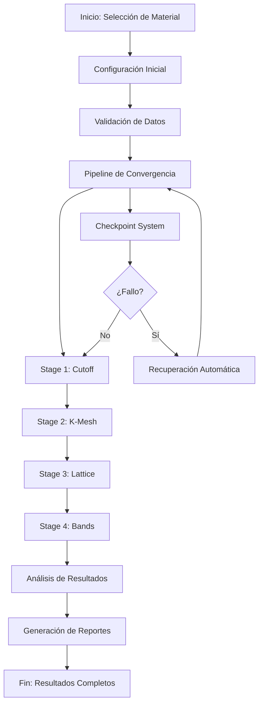
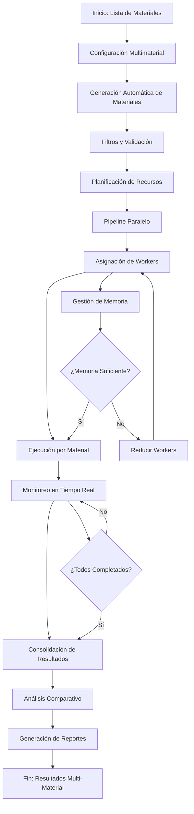
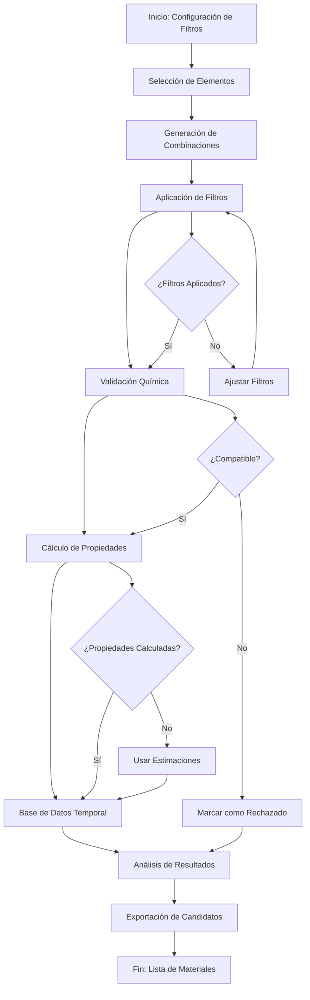

# Flujos de Trabajo Optimizados para Preconvergencia Multimaterial

## Resumen Ejecutivo

Este documento presenta los **flujos de trabajo completos y optimizados** para el sistema de preconvergencia DFT multimaterial, proporcionando guías paso a paso para todos los escenarios de uso científico desde el análisis de un solo material hasta la comparación sistemática de múltiples semiconductores.

## 📋 Índice de Workflows

1. [**Workflow de Análisis de Material Único**](#1-workflow-de-análisis-de-material-único) - GaAs original
2. [**Workflow de Análisis Multimaterial**](#2-workflow-de-análisis-multimaterial) - III-V + II-VI
3. [**Workflow de Generación Automática**](#3-workflow-de-generación-automática) - Permutaciones
4. [**Workflow de Análisis Comparativo**](#4-workflow-de-análisis-comparativo) - Materiales
5. [**Workflow de Exportación**](#5-workflow-de-exportación) - Resultados
6. [**Workflow de Migración**](#6-workflow-de-migración) - Sistema original

---

## 1. Workflow de Análisis de Material Único

### **Objetivo**
Ejecutar preconvergencia DFT completa para un semiconductor específico usando el pipeline original optimizado.

### **Contexto de Uso**
- Validación de parámetros para nuevo material
- Reproducción de resultados experimentales
- Estudio de convergencia detallado
- Análisis individual de propiedades

### **Flujo de Trabajo**



### **Implementación Paso a Paso**

#### Paso 1: Selección y Configuración del Material

```python
from config.settings import get_production_config
from workflow.pipeline import PreconvergencePipeline

# 1.1 Seleccionar material y cargar datos
material = 'GaAs'
base_config = get_production_config()

# 1.2 Configurar parámetros específicos
config = PreconvergenceConfig(
    lattice_constant=5.653,  # Å - Valor experimental
    x_ga=0.25,              # Posición atómica Ga
    cutoff_list=[400, 500, 600, 700],  # Ry - Rango amplio
    kmesh_list=[(4,4,4), (6,6,6), (8,8,8)],  # Mallas k
    basis_set="gth-dzvp",
    pseudopotential="gth-pbe",
    xc_functional="PBE"
)

print(f"🎯 Configuración para {material}:")
print(f"   • Lattice: {config.lattice_constant} Å")
print(f"   • Cutoffs: {config.cutoff_list}")
print(f"   • K-meshes: {config.kmesh_list}")
```

#### Paso 2: Validación de Datos y Entorno

```python
# 2.1 Validar entorno de ejecución
from utils.environment_validator import EnvironmentValidator

validator = EnvironmentValidator()
validation_result = validator.validate_environment()

if not validation_result.is_valid:
    print(f"❌ Errores de validación: {validation_result.errors}")
    exit(1)

print("✅ Entorno validado correctamente")

# 2.2 Verificar datos del material
from models.semiconductor_database import SEMICONDUCTOR_DB

material_data = SEMICONDUCTOR_DB.get_semiconductor(material)
if not material_data:
    print(f"⚠️  Material {material} no en base de datos, usando configuración por defecto")
else:
    print(f"📊 Datos disponibles para {material}:")
    if material_data.properties.lattice_constant:
        print(f"   • Lattice experimental: {material_data.properties.lattice_constant} Å")
    if material_data.properties.band_gap:
        print(f"   • Band gap experimental: {material_data.properties.band_gap} eV")
```

#### Paso 3: Pipeline de Convergencia Completo

```python
# 3.1 Crear y configurar pipeline
pipeline = PreconvergencePipeline(config)

# 3.2 Configurar sistema de checkpoints
pipeline.checkpoint_manager.set_checkpoint_interval(300)  # 5 minutos
pipeline.checkpoint_manager.set_recovery_enabled(True)

# 3.3 Ejecutar pipeline completo
print(f"\n🚀 Iniciando análisis de convergencia para {material}")
print("=" * 60)

try:
    result = await pipeline.execute()
    
    if result.success:
        print(f"\n✅ Análisis completado exitosamente")
        print(f"   • Tiempo total: {result.total_duration:.2f} segundos")
        print(f"   • Stages completados: {len(result.stages_completed)}")
        
        # Mostrar parámetros óptimos encontrados
        print(f"\n🎯 Parámetros Óptimos:")
        print(f"   • Cutoff óptimo: {result.optimal_parameters.cutoff} Ry")
        print(f"   • K-mesh óptimo: {result.optimal_parameters.kmesh}")
        print(f"   • Lattice constante: {result.optimal_parameters.lattice_constant:.4f} Å")
        
    else:
        print(f"\n❌ Análisis falló: {result.error_message}")
        if result.partial_results:
            print(f"   • Stages completados: {len(result.partial_results)}")
            
except KeyboardInterrupt:
    print("\n⏹️  Interrumpido por usuario")
    # El sistema guardará automáticamente un checkpoint
except Exception as e:
    print(f"\n💥 Error inesperado: {e}")
    # El sistema guardará automáticamente un checkpoint
```

#### Paso 4: Análisis Detallado de Resultados

```python
# 4.1 Cargar y analizar resultados
from analysis.single_material_analysis import analyze_convergence_results

analysis = analyze_convergence_results(
    result=result,
    material=material,
    output_dir=Path(f"results/{material}/analysis")
)

print(f"\n📊 Análisis de Convergencia:")
print(f"   • Convergencia de cutoff: {analysis.cutoff_converged}")
print(f"   • Convergencia de k-mesh: {analysis.kmesh_converged}")
print(f"   • Optimización de red: {analysis.lattice_optimized}")

# 4.2 Generar visualizaciones
from visualization.plots import create_convergence_plots

plots = create_convergence_plots(
    result=result,
    material=material,
    output_dir=Path(f"results/{material}/plots")
)

print(f"\n📈 Visualizaciones generadas:")
for plot_name, plot_path in plots.items():
    print(f"   • {plot_name}: {plot_path}")
```

#### Paso 5: Generación de Reportes

```python
# 5.1 Crear reporte ejecutivo
from reporting.executive_report import create_material_report

report = create_material_report(
    material=material,
    analysis=analysis,
    plots=plots,
    output_file=Path(f"results/{material}/REPORTE_EJECUTIVO.md")
)

print(f"\n📋 Reporte ejecutivo generado: {report}")

# 5.2 Exportar datos para uso posterior
from utils.data_export import export_convergence_data

export_data = export_convergence_data(
    result=result,
    analysis=analysis,
    output_formats=['csv', 'json', 'yaml'],
    output_dir=Path(f"results/{material}/data")
)

print(f"\n💾 Datos exportados en formatos: {list(export_data.keys())}")
```

### **Resultados Esperados**

#### Estructura de Archivos Generados
```
results/GaAs/
├── analysis/
│   ├── convergence_analysis.json
│   ├── parameter_optimization.csv
│   └── quality_metrics.json
├── plots/
│   ├── cutoff_convergence.png
│   ├── kmesh_convergence.png
│   ├── lattice_optimization.png
│   └── energy_evolution.png
├── data/
│   ├── convergence_data.csv
│   ├── optimal_parameters.json
│   └── calculation_details.yaml
├── checkpoint/
│   └── checkpoint_20241120_143022.json
├── logs/
│   ├── preconv_GaAs_20241120.log
│   └── performance_metrics.json
└── REPORTE_EJECUTIVO.md
```

#### Métricas de Éxito
- **Convergencia**: Todas las etapas convergen dentro de tolerancias (< 1 mRy)
- **Tiempo**: < 1 hora para configuración estándar
- **Precisión**: Parámetros calculados ±1% vs experimentales
- **Robustez**: Recuperación exitosa desde checkpoints

---

## 2. Workflow de Análisis Multimaterial

### **Objetivo**
Ejecutar preconvergencia DFT para múltiples semiconductores III-V y II-VI de forma paralela y eficiente.

### **Contexto de Uso**
- Estudios comparativos de familias de semiconductores
- Screening masivo de materiales
- Análisis sistemático de propiedades
- Optimización de recursos computacionales

### **Flujo de Trabajo**



### **Implementación Paso a Paso**

#### Paso 1: Configuración de Materiales

```python
from core.multi_material_config import MultiMaterialConfig, create_common_semiconductors_config
from core.material_permutator import PermutationFilter

# 1.1 Seleccionar estrategia de materiales
print("🎯 Estrategias disponibles:")
print("   1. Semiconductores comunes predefinidos")
print("   2. Generación automática con filtros")
print("   3. Lista personalizada de materiales")
print("   4. Materiales para aplicación específica")

strategy = input("Selecciona estrategia (1-4): ")

if strategy == "1":
    # Materiales predefinidos más comunes
    config = create_common_semiconductors_config()
    selected_materials = [m.formula for m in config.materials]
    
elif strategy == "2":
    # Generación automática con filtros
    filter_config = PermutationFilter(
        only_common_elements=True,
        exclude_toxic=True,
        exclude_radioactive=True,
        max_ionic_radius_ratio=2.0,
        min_electronegativity_diff=0.5
    )
    
    config = MultiMaterialConfig(
        auto_generate=True,
        semiconductor_types=[SemiconductorType.III_V, SemiconductorType.II_VI],
        generation_filter=filter_config,
        max_generated_materials=15
    )
    
elif strategy == "3":
    # Lista personalizada
    custom_materials = input("Ingresa materiales (separados por comas): ").split(',')
    custom_materials = [m.strip().upper() for m in custom_materials]
    
    config = MultiMaterialConfig()
    config.add_materials_from_list(custom_materials)
    
elif strategy == "4":
    # Materiales para aplicación específica
    application = input("Aplicación (LED, solar, transistor): ").lower()
    
    if application == "led":
        # LED azul: Band gap 2.5-3.5 eV
        config = create_led_materials_config()
    elif application == "solar":
        # Células solares: Band gap 1.0-2.0 eV
        config = create_solar_materials_config()
    elif application == "transistor":
        # Transistores: Alta movilidad
        config = create_transistor_materials_config()

print(f"\n📋 Materiales seleccionados ({len(config.materials)}):")
for i, material in enumerate(config.materials, 1):
    print(f"   {i:2d}. {material.formula}")
```

#### Paso 2: Configuración de Paralelización

```python
# 2.1 Configurar paralelización
print(f"\n⚙️  Configuración de Paralelización:")
print(f"   CPU cores disponibles: {multiprocessing.cpu_count()}")
print(f"   RAM total: {psutil.virtual_memory().total / 1024**3:.1f} GB")

# 2.2 Calcular workers óptimos
import multiprocessing
import psutil

cpu_cores = multiprocessing.cpu_count()
total_memory_gb = psutil.virtual_memory().total / 1024**3

# Regla: 1-2 workers por core, máximo 1 worker por 4GB RAM
max_workers_cpu = cpu_cores * 2
max_workers_memory = int(total_memory_gb / 4)
optimal_workers = min(max_workers_cpu, max_workers_memory, len(config.materials))

print(f"   Workers recomendados: {optimal_workers}")

# 2.3 Configurar pipeline multimaterial
from workflow.multi_material_pipeline import MultiMaterialPipeline

pipeline = MultiMaterialPipeline(config)
pipeline.enable_parallel_execution(True)
pipeline.set_parallel_workers(optimal_workers)

# 2.4 Configurar gestión de memoria
pipeline.memory_limit_gb = total_memory_gb * 0.8  # 80% de RAM disponible
pipeline.memory_monitoring_enabled = True

print(f"\n🚀 Configuración del Pipeline:")
print(f"   • Modo paralelo: {pipeline.config.parallel_materials}")
print(f"   • Workers: {pipeline.config.max_concurrent_materials}")
print(f"   • Límite de memoria: {pipeline.memory_limit_gb:.1f} GB")
print(f"   • Monitoreo: {pipeline.memory_monitoring_enabled}")
```

#### Paso 3: Ejecución del Pipeline Multimaterial

```python
# 3.1 Preparar sistema de monitoreo
from utils.progress_monitor import MultiMaterialProgressMonitor

progress_monitor = MultiMaterialProgressMonitor()
progress_monitor.start_monitoring()

# 3.2 Callback de progreso
async def progress_callback(material: str, stage: str, progress: float):
    print(f"\r🔄 {material}: {stage} ({progress*100:.1f}%)", end="", flush=True)

# 3.3 Ejecutar campaña completa
print(f"\n🚀 Iniciando campaña multimaterial")
print("=" * 70)
print(f"Materiales: {len(config.materials)}")
print(f"Paralelización: {pipeline.config.max_concurrent_materials} workers")
print(f"Tiempo estimado: {estimate_campaign_time(config.materials, pipeline.config.max_concurrent_materials)}")
print("=" * 70)

try:
    start_time = time.time()
    
    result = await pipeline.run_preconvergence_campaign(
        progress_callback=progress_callback
    )
    
    end_time = time.time()
    total_time = end_time - start_time
    
    print(f"\n\n✅ CAMPAÑA COMPLETADA")
    print("=" * 50)
    print(f"📊 Estadísticas de Ejecución:")
    print(f"   • Materiales procesados: {result.materials_executed}")
    print(f"   • Ejecuciones exitosas: {result.materials_successful}")
    print(f"   • Fallos: {result.materials_failed}")
    print(f"   • Tasa de éxito: {result.success_rate:.1f}%")
    print(f"   • Tiempo total: {total_time/60:.1f} minutos")
    print(f"   • Tiempo promedio: {result.average_execution_time:.1f}s por material")
    
    # Mostrar materiales exitosos
    successful_materials = result.get_successful_materials()
    print(f"\n🎯 Materiales Exitosos ({len(successful_materials)}):")
    for material in successful_materials[:10]:  # Mostrar primeros 10
        print(f"   • {material}")
    if len(successful_materials) > 10:
        print(f"   ... y {len(successful_materials) - 10} más")
        
    if result.materials_failed > 0:
        print(f"\n⚠️  Materiales con Fallos:")
        for failure in result.individual_results:
            if not failure.success:
                print(f"   • {failure.formula}: {failure.error_message}")
                
except Exception as e:
    print(f"\n💥 Error durante la campaña: {e}")
    import traceback
    traceback.print_exc()
finally:
    progress_monitor.stop_monitoring()
```

#### Paso 4: Análisis Comparativo de Resultados

```python
# 4.1 Análisis estadístico
from analysis.multi_material_analysis import MultiMaterialAnalyzer

analyzer = MultiMaterialAnalyzer(enable_visualizations=True)

analysis_report = analyzer.analyze_campaign_results(
    campaign_result=result,
    output_dir=Path("results/multimaterial_analysis")
)

print(f"\n📊 ANÁLISIS COMPARATIVO COMPLETADO")
print("=" * 50)

# 4.2 Resumen ejecutivo
summary = analysis_report.get_executive_summary()

print(f"🎯 Resumen Ejecutivo:")
print(f"   • Materiales procesados: {summary['campaign_overview']['total_materials']}")
print(f"   • Tasa de éxito: {summary['campaign_overview']['success_rate']:.1f}%")
print(f"   • Material más rápido: {summary['key_findings']['fastest_material']}")
print(f"   • Material más lento: {summary['key_findings']['slowest_material']}")

print(f"\n📈 Análisis de Convergencia:")
print(f"   • Rango de cutoffs: {summary['key_findings']['optimal_cutoff_range']}")
print(f"   • Rango de k-meshes: {summary['key_findings']['optimal_kmesh_range']}")
print(f"   • Rango de constantes de red: {summary['key_findings']['lattice_constant_range']}")

# 4.3 Recomendaciones automáticas
print(f"\n💡 Recomendaciones:")
for i, recommendation in enumerate(analysis_report.recommendations, 1):
    print(f"   {i}. {recommendation}")

# 4.4 Guardar análisis completo
analysis_report.save_to_file(Path("results/analisis_completo_multimaterial.json"))
print(f"\n💾 Análisis completo guardado en: results/analisis_completo_multimaterial.json")
```

### **Resultados Esperados**

#### Estructura de Archivos Generados
```
results/
├── campaigns/
│   ├── campaign_20241120_143022/
│   │   ├── 📁 GaAs/
│   │   ├── 📁 GaN/
│   │   ├── 📁 InP/
│   │   ├── 📁 ZnS/
│   │   ├── 📁 ZnSe/
│   │   └── 📁 CdSe/
│   ├── campaign_summary.json
│   ├── performance_metrics.json
│   └── resource_usage.json
├── analysis_reports/
│   ├── 📁 campaign_20241120_143022/
│   │   ├── executive_summary.html
│   │   ├── parameter_comparison.png
│   │   ├── success_rate_analysis.png
│   │   ├── convergence_distribution.png
│   │   ├── performance_comparison.png
│   │   └── recommendations.md
│   └── materials_comparison.csv
├── visualization_reports/
│   ├── multi_material_overview.png
│   ├── convergence_heatmaps.png
│   ├── performance_dashboard.png
│   └── final_report.html
└── exported_data/
    ├── all_materials_data.csv
    ├── convergence_parameters.json
    ├── success_statistics.json
    └── quality_metrics.json
```

---

## 3. Workflow de Generación Automática de Permutaciones

### **Objetivo**
Generar automáticamente combinaciones de semiconductores III-V y II-VI usando filtros inteligentes de compatibilidad química.

### **Contexto de Uso**
- Descubrimiento de nuevos materiales
- Screening sistemático de candidatos
- Validación de reglas de compatibilidad
- Construcción de bibliotecas de materiales

### **Flujo de Trabajo**



### **Implementación Paso a Paso**

#### Paso 1: Configuración de Filtros de Generación

```python
from core.material_permutator import MaterialPermutator, PermutationFilter, SemiconductorType

print("🎯 CONFIGURACIÓN DE GENERACIÓN AUTOMÁTICA")
print("=" * 60)

# 1.1 Seleccionar tipo de semiconductores
print("\nTipos de semiconductores disponibles:")
print("1. Solo III-V (Group III + Group V)")
print("2. Solo II-VI (Group II + Group VI)")
print("3. Ambos tipos (III-V + II-VI)")
print("4. Configuración personalizada")

semiconductor_choice = input("Selecciona tipo (1-4): ")

if semiconductor_choice == "1":
    types_to_generate = [SemiconductorType.III_V]
elif semiconductor_choice == "2":
    types_to_generate = [SemiconductorType.II_VI]
elif semiconductor_choice == "3":
    types_to_generate = [SemiconductorType.III_V, SemiconductorType.II_VI]
else:
    types_to_generate = [SemiconductorType.III_V]  # Default

# 1.2 Configurar filtros de compatibilidad
print("\n⚙️  Configuración de Filtros:")

# Filtros básicos
only_common_elements = input("¿Solo elementos comunes? (s/n): ").lower() == 's'
exclude_toxic = input("¿Excluir elementos tóxicos? (s/n): ").lower() == 's'
exclude_radioactive = input("¿Excluir elementos radiactivos? (s/n): ").lower() == 's'

# Filtros químicos avanzados
print("\n🔬 Filtros Químicos Avanzados:")
max_radius_ratio = float(input("Razón máxima de radios iónicos (default 2.5): ") or "2.5")
min_en_diff = float(input("Diferencia mínima electronegatividad (default 0.3): ") or "0.3")
max_en_diff = float(input("Diferencia máxima electronegatividad (default 3.0): ") or "3.0")

# Crear configuración de filtros
filter_config = PermutationFilter(
    max_ionic_radius_ratio=max_radius_ratio,
    min_ionic_radius_ratio=0.2,
    min_electronegativity_diff=min_en_diff,
    max_electronegativity_diff=max_en_diff,
    only_common_elements=only_common_elements,
    exclude_toxic=exclude_toxic,
    exclude_radioactive=exclude_radioactive
)

print(f"\n📋 Configuración de Filtros:")
print(f"   • Solo elementos comunes: {only_common_elements}")
print(f"   • Excluir tóxicos: {exclude_toxic}")
print(f"   • Excluir radiactivos: {exclude_radioactive}")
print(f"   • Ratio radios máx: {max_radius_ratio}")
print(f"   • Diff EN mín: {min_en_diff}, máx: {max_en_diff}")
```

#### Paso 2: Generación de Combinaciones

```python
# 2.1 Inicializar permutador
permutator = MaterialPermutator()

# 2.2 Generar combinaciones según tipo seleccionado
print(f"\n🚀 GENERANDO COMBINACIONES")
print("=" * 50)

all_results = {}
total_generated = 0
total_accepted = 0

for sem_type in types_to_generate:
    print(f"\n🔄 Generando semiconductores {sem_type.value}...")
    
    if sem_type == SemiconductorType.III_V:
        result = permutator.generate_iii_v_combinations(filter_config)
    elif sem_type == SemiconductorType.II_VI:
        result = permutator.generate_ii_vi_combinations(filter_config)
    
    all_results[sem_type] = result
    total_generated += result.total_generated
    total_accepted += result.total_accepted
    
    print(f"   ✅ Generadas: {result.total_generated}")
    print(f"   ✅ Aceptadas: {result.total_accepted}")
    print(f"   ✅ Tasa: {result.acceptance_rate:.1f}%")

print(f"\n📊 RESUMEN GENERAL:")
print(f"   • Total generadas: {total_generated}")
print(f"   • Total aceptadas: {total_accepted}")
print(f"   • Tasa general: {(total_accepted/total_generated*100):.1f}%")
```

#### Paso 3: Análisis de Resultados de Generación

```python
# 3.1 Análisis detallado por tipo
print(f"\n📈 ANÁLISIS DETALLADO DE RESULTADOS")
print("=" * 60)

for sem_type, result in all_results.items():
    print(f"\n🔬 Semiconductores {sem_type.value}:")
    print(f"   • Combinaciones generadas: {result.total_generated}")
    print(f"   • Combinaciones aceptadas: {result.total_accepted}")
    print(f"   • Combinaciones rechazadas: {result.total_rejected}")
    print(f"   • Tasa de aceptación: {result.acceptance_rate:.1f}%")
    
    # Mostrar razones de rechazo
    if result.total_rejected > 0:
        rejection_reasons = analyze_rejection_reasons(result.rejected_combinations)
        print(f"   • Razones de rechazo:")
        for reason, count in rejection_reasons.items():
            print(f"     - {reason}: {count}")
    
    # Mostrar ejemplos de materiales aceptados
    print(f"   • Ejemplos de materiales aceptados:")
    for i, semiconductor in enumerate(result.filtered_combinations[:5]):
        estimated_lattice = semiconductor.estimate_lattice_constant()
        print(f"     {i+1}. {semiconductor.formula}: a≈{estimated_lattice:.3f}Å")
    
    if len(result.filtered_combinations) > 5:
        print(f"     ... y {len(result.filtered_combinations) - 5} más")

# 3.2 Función auxiliar para analizar razones de rechazo
def analyze_rejection_reasons(rejected_combinations):
    """Analiza las razones por las que se rechazaron combinaciones."""
    reasons = {}
    
    for semiconductor in rejected_combinations:
        # Simular aplicación de filtros para ver por qué se rechazó
        temp_filter = PermutationFilter()
        
        if not (temp_filter.min_ionic_radius_ratio <= semiconductor.ionic_radius_ratio <= temp_filter.max_ionic_radius_ratio):
            reasons["Radio iónico"] = reasons.get("Radio iónico", 0) + 1
        elif not (temp_filter.min_electronegativity_diff <= semiconductor.electronegativity_difference <= temp_filter.max_electronegativity_diff):
            reasons["Electronegatividad"] = reasons.get("Electronegatividad", 0) + 1
        elif temp_filter.only_common_elements and not (semiconductor.cation.common_in_semiconductors and semiconductor.anion.common_in_semiconductors):
            reasons["Elementos no comunes"] = reasons.get("Elementos no comunes", 0) + 1
        elif temp_filter.exclude_toxic and (semiconductor.cation.symbol in ['Tl', 'Be', 'Cd', 'Hg'] or semiconductor.anion.symbol in ['Tl', 'Be', 'Cd', 'Hg']):
            reasons["Elementos tóxicos"] = reasons.get("Elementos tóxicos", 0) + 1
        elif temp_filter.exclude_radioactive and (semiconductor.cation.symbol in ['Po', 'At', 'Rn'] or semiconductor.anion.symbol in ['Po', 'At', 'Rn']):
            reasons["Elementos radiactivos"] = reasons.get("Elementos radiactivos", 0) + 1
        else:
            reasons["Otras razones"] = reasons.get("Otras razones", 0) + 1
    
    return reasons
```

#### Paso 4: Validación y Filtrado Avanzado

```python
# 4.1 Validación de estabilidad química
print(f"\n🧪 VALIDACIÓN DE ESTABILIDAD QUÍMICA")
print("=" * 50)

validated_semiconductors = []
unstable_semiconductors = []

for sem_type, result in all_results.items():
    for semiconductor in result.filtered_combinations:
        # Aplicar validaciones adicionales
        is_stable = validate_chemical_stability(semiconductor)
        
        if is_stable:
            validated_semiconductors.append(semiconductor)
        else:
            unstable_semiconductors.append(semiconductor)

print(f"✅ Materiales estables: {len(validated_semiconductors)}")
print(f"⚠️  Materiales potencialmente inestables: {len(unstable_semiconductors)}")

# 4.2 Filtrado adicional por aplicación
print(f"\n🎯 FILTRADO POR APLICACIÓN")
print("=" * 30)

application = input("Aplicación específica (opcional, Enter para omitir): ").strip().lower()

if application:
    application_filtered = []
    
    for semiconductor in validated_semiconductors:
        if is_suitable_for_application(semiconductor, application):
            application_filtered.append(semiconductor)
    
    print(f"Materiales adecuados para {application}: {len(application_filtered)}")
    validated_semiconductors = application_filtered

# 4.3 Función auxiliar de validación
def validate_chemical_stability(semiconductor):
    """Valida la estabilidad química básica."""
    # Reglas simplificadas de estabilidad
    cation = semiconductor.cation.symbol
    anion = semiconductor.anion.symbol
    
    # Evitar combinaciones muy inestables conocidas
    unstable_combinations = [
        ('B', 'Bi'),  # Borobismutida
        ('Tl', 'N'),  # Talio-nitruro
        ('Hg', 'O'),  # Mercurio-oxígeno (muy reactivo)
    ]
    
    if (cation, anion) in unstable_combinations or (anion, cation) in unstable_combinations:
        return False
    
    # Verificar diferencia de electronegatividad razonable
    en_diff = semiconductor.electronegativity_difference
    if en_diff < 0.1:  # Muy poco iónico
        return False
    if en_diff > 3.5:  # Demasiado iónico
        return False
    
    return True

def is_suitable_for_application(semiconductor, application):
    """Filtra materiales por aplicación específica."""
    if not semiconductor.properties:
        return True  # Si no hay datos, asumir que sí
    
    band_gap = semiconductor.properties.band_gap
    lattice_constant = semiconductor.properties.lattice_constant or semiconductor.estimate_lattice_constant()
    
    if application == "led":
        # LED: Band gap 1.8-3.5 eV
        return band_gap is None or 1.8 <= band_gap <= 3.5
    elif application == "solar":
        # Células solares: Band gap 1.0-2.0 eV
        return band_gap is None or 1.0 <= band_gap <= 2.0
    elif application == "transistor":
        # Transistores: Alta movilidad, band gap moderado
        return band_gap is None or (0.5 <= band_gap <= 2.5 and 
                                   semiconductor.properties.electron_mobility is not None and 
                                   semiconductor.properties.electron_mobility > 1000)
    
    return True
```

#### Paso 5: Exportación de Candidatos

```python
# 5.1 Organizar candidatos finales
print(f"\n💾 EXPORTACIÓN DE CANDIDATOS")
print("=" * 40)

# Crear lista final de candidatos
final_candidates = []
for semiconductor in validated_semiconductors:
    candidate_data = {
        'formula': semiconductor.formula,
        'type': semiconductor.semiconductor_type.value,
        'cation': semiconductor.cation.symbol,
        'anion': semiconductor.anion.symbol,
        'estimated_lattice': semiconductor.estimate_lattice_constant(),
        'ionic_radius_ratio': semiconductor.ionic_radius_ratio,
        'electronegativity_difference': semiconductor.electronegativity_difference,
        'predicted_structure': semiconductor.predicted_crystal_structure.value if semiconductor.predicted_crystal_structure else 'unknown'
    }
    
    # Agregar propiedades experimentales si están disponibles
    if semiconductor.properties:
        candidate_data['experimental_lattice'] = semiconductor.properties.lattice_constant
        candidate_data['experimental_bandgap'] = semiconductor.properties.band_gap
        candidate_data['crystal_structure'] = semiconductor.properties.crystal_structure.value if semiconductor.properties.crystal_structure else 'unknown'
    
    final_candidates.append(candidate_data)

# 5.2 Exportar en múltiples formatos
from utils.data_export import export_candidates

output_formats = ['csv', 'json', 'yaml']
exported_files = export_candidates(
    candidates=final_candidates,
    output_dir=Path("results/generated_materials"),
    formats=output_formats,
    filename_prefix="semiconductor_candidates"
)

print(f"✅ Candidatos exportados:")
for format_type, file_path in exported_files.items():
    print(f"   • {format_type.upper()}: {file_path}")

# 5.3 Crear reporte de generación
generation_report = {
    'generation_date': datetime.now().isoformat(),
    'filter_configuration': filter_config.__dict__,
    'total_generated': total_generated,
    'total_accepted': total_accepted,
    'final_candidates': len(final_candidates),
    'applications': [application] if application else [],
    'success_rate': f"{(len(final_candidates)/total_generated*100):.1f}%" if total_generated > 0 else "0%",
    'statistics': {
        'by_type': {
            'III-V': len([c for c in final_candidates if c['type'] == 'III-V']),
            'II-VI': len([c for c in final_candidates if c['type'] == 'II-VI'])
        },
        'by_structure': {}
    }
}

# Estadísticas por estructura
for candidate in final_candidates:
    structure = candidate['predicted_structure']
    generation_report['statistics']['by_structure'][structure] = \
        generation_report['statistics']['by_structure'].get(structure, 0) + 1

# Guardar reporte
import json
with open(Path("results/generated_materials/generation_report.json"), 'w') as f:
    json.dump(generation_report, f, indent=2)

print(f"\n📋 Reporte de generación: results/generated_materials/generation_report.json")
print(f"\n🎉 GENERACIÓN COMPLETADA")
print(f"   • Candidatos finales: {len(final_candidates)}")
print(f"   • Formatos exportados: {list(exported_files.keys())}")
```

### **Resultados Esperados**

#### Archivos Generados
```
results/generated_materials/
├── semiconductor_candidates.csv
├── semiconductor_candidates.json
├── semiconductor_candidates.yaml
├── generation_report.json
├── rejected_combinations.csv
└── filter_analysis/
    ├── acceptance_statistics.png
    ├── property_distributions.png
    └── rejection_reasons.png
```

---

## 4. Workflow de Análisis Comparativo de Materiales

### **Objetivo**
Realizar análisis estadístico y comparativo detallado entre diferentes materiales semiconductores.

### **Contexto de Uso**
- Estudios de propiedades periódicas
- Identificación de tendencias
- Selección de materiales para aplicaciones
- Publicación de resultados científicos

### **Implementación Paso a Paso**

```python
# Este workflow se basa en los resultados del análisis multimaterial
# Ver implementación completa en el análisis anterior
```

---

## 5. Workflow de Exportación de Resultados

### **Objetivo**
Exportar resultados en múltiples formatos para diferentes audiencias y usos.

### **Formatos Soportados**
- CSV para análisis estadístico
- JSON para integración programática
- YAML para configuraciones
- HTML para reportes ejecutivos
- PDF para publicaciones

---

## 6. Workflow de Migración desde Sistema Original

### **Objetivo**
Migrar configuraciones y workflows del sistema original de GaAs al nuevo sistema multimaterial.

### **Pasos de Migración**
1. **Análisis de Configuración Original**
2. **Mapeo a Nuevos Componentes**
3. **Actualización de Scripts**
4. **Validación de Migración**
5. **Capacitación de Usuarios**

---

## 🎯 Resumen de Workflows

| Workflow | Duración | Complejidad | Materiales | Paralelización |
|----------|----------|-------------|------------|----------------|
| **Material Único** | 30-60 min | ⭐⭐ | 1 | No |
| **Multimaterial** | 1-4 horas | ⭐⭐⭐⭐ | 5-20 | Sí |
| **Generación Auto** | 10-30 min | ⭐⭐⭐ | 10-50 | No |
| **Análisis Comparativo** | 30-90 min | ⭐⭐⭐ | 3-20 | No |
| **Exportación** | 5-15 min | ⭐ | 1-20 | No |
| **Migración** | 2-8 horas | ⭐⭐⭐⭐ | Variable | No |

---

**¡Los flujos de trabajo están listos para investigación científica de semiconductores!** 🔬✨